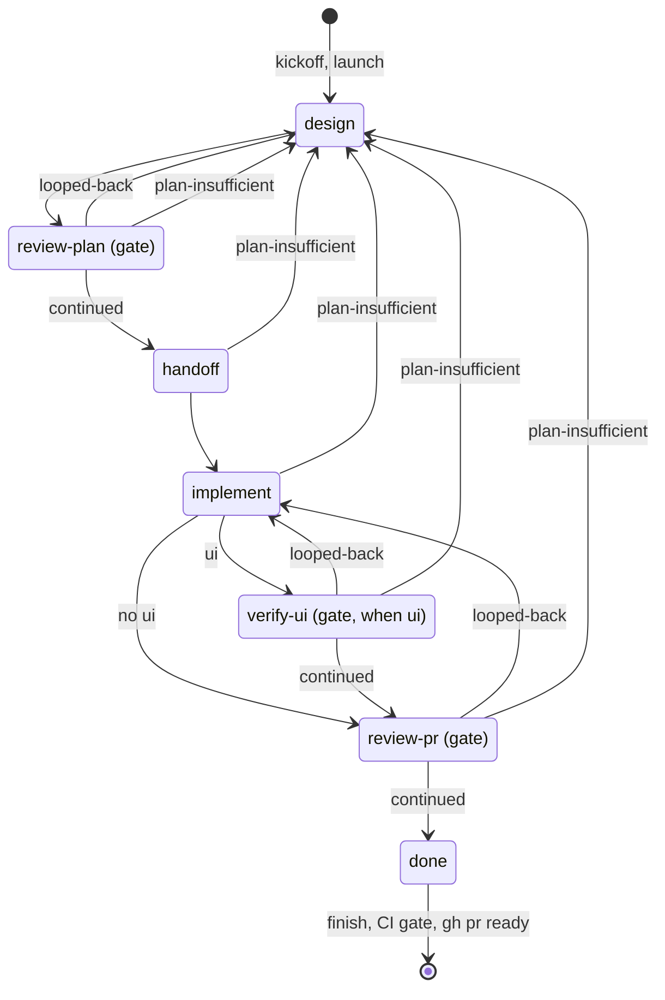

# pipeline: split engine.md by reader, one reference per step — Implementation Plan

> **For agentic workers:** REQUIRED SUB-SKILL: Use superpowers:subagent-driven-development (recommended) or superpowers:executing-plans to implement this plan task-by-task. Steps use checkbox (`- [ ]`) syntax for tracking.

**Goal:** `skills/pipeline/references/engine.md` is replaced by one reference per step, one for the invoking
session, one for the maintainer, one for the proof store and nine shared rule files; `SKILL.md` becomes the
one-page overview with the state machine; history moves to `DECISIONS.md`; every brief names its step's file and
cites files, never sections; tests hold each rule's home, every section reference, and history out of rule text.

**Architecture:** Content moves first, while `engine.md` still stands (Tasks 2–4), each new file pinned by the
lock-steps that move with it. Then the briefs point at the new files (Task 5), `SKILL.md` becomes the overview
(Task 6), `engine.md` is deleted and every reference rewritten under a new `DocLinksTest` (Task 7), and the history
guard closes it (Task 8). `DECISIONS.md` is created in Task 2 and grows in every content task, so history cut from a
section lands there in the same commit.

**Tech Stack:** Markdown; PHP 8.4 (no framework) and Pest 4 in `skills/pipeline/checks/tests`; one shell test
(`skills/orchestrate/tests/teardown_test.sh`).

**Spec:** `docs/superpowers/specs/2026-10-03-pipeline-split-engine-md-by-reader-design.md`. Read it whole with this
plan: its *Design* section names every file and what it holds, and its `## Assumptions` A10–A17 are the answers
this plan assumed (citation format, the references directory, `DECISIONS.md` and `engine.md`, the guard's case,
`design:run`'s row, the unassigned parts, rationale, runs in flight).

## Global Constraints

- Run every command from the worktree root
  `/Users/jroelofs/GitProjects/LaravelClaudeMd/LaravelClaudeMd/.claude/worktrees/worktree-issue-128-pipeline-split-engine-md-by-reader-one-reference`.
- Tests: `./vendor/bin/pest -c skills/pipeline/checks/phpunit.xml --test-directory=skills/pipeline/checks/tests`
  (append `--filter '<pattern>'` for a subset). Not a Docker project: Pest runs on the host. The worktree has no
  `vendor/`: run `composer install` once first. The suite needs `node` on `PATH`. `php -l` every PHP file you change.
- **Source of truth for moved text:** `engine.md` as of `93b6663` (`git show 93b6663:skills/pipeline/references/engine.md`).
  Every line number below (`E<n>`) is that file's; `S<n>` is `skills/pipeline/SKILL.md`'s, `G<n>` `gates.md`'s,
  `M<n>` `manifest.md`'s, all as of `93b6663`.
- **Moving is not rewriting.** Rule text keeps its wording. You change only: a cross-reference (to the owning file,
  form below), a restated rule (becomes a pointer to its owner), history (moves to `DECISIONS.md`), and a rationale
  longer than one line (cut to one line; the rest to `DECISIONS.md`, spec A16). Do not add rules.
- **Citation form** (spec A10). Name a file by its path relative to `references/`: `session.md`, `steps/design.md`,
  `shared/catch-up.md`; the skill's root files as `SKILL.md`, `DECISIONS.md` (from a reference: `../SKILL.md`). A
  section is `` `session.md` §The CI gate ``, its heading text up to its ` — `. A `§` with no file before it names a
  heading of the same file, so a chain repeats the file: `` `shared/checks.md` §Mechanical checks, `shared/suite.md`
  §Suite reuse ``. Briefs cite files only: `(shared/catch-up.md)`, `(shared/checks.md, shared/suite.md)`.
- **Present tense.** Rule text says what the pipeline does now. No `Why (#`, no line starting `Why:`, no
  `before #<n>` (any case), no `when this lands`, no "as it did before", "used to", "previously", "no longer".
  A compatibility rule that still acts stays, worded as behaviour (spec *Present tense*). At most one line of why,
  with its issue number: "One automatic fix round per run (#85)".
- **The ownership rule** (spec *The files*): a rule lives in one file; everyone else points at it. A step file
  addresses only its step's agent (and, in `interactive`, the session acting as `design` or a resolve step), plus
  at most one line on where its work goes next. A shared file's second line is `Read by: ` and the step files that
  read it; a step file's second line is `Read also: ` and the shared files it reads, each in backticks. Both are
  checked against each other (Task 3).
- **`DECISIONS.md` entries:** `## #<n> — <title>`, newest issue first; an entry for history with no issue is keyed
  `## PR #<n> — <title>` or `## <YYYY-MM-DD> — <title>`, and sits after the issue entries, newest first. Each says
  what was decided, the measurement when there is one, and what it replaced. Find the issue, PR or date of an unlabeled
  passage with `git log -S '<a phrase of it>' --oneline -- skills/pipeline/` and `gh pr list --state merged --search <sha>`.
- Commits: stage explicit paths, no `Co-Authored-By`, no AI attribution; every message ends on `(#128)`.
- No changelog entry: the repo has no `.changelog/` and no `CHANGELOG.md`.
- Specs and plans under `docs/` are records: leave their `engine.md` references alone.

## Review Focus

1. **A rule that landed in two files, or in none.** The mapping table below is the checklist: every `E` range has
   one destination. Task 7's Step 1 diffs the old file against the new ones by sentence before `engine.md` goes.
2. **A wrapped section reference** (`§Who takes the PR out of` / `draft` across a line break): `DocLinksTest`
   collapses whitespace before it compares, so it must pass on a wrapped reference and fail on a wrong one. Pinned by
   its own fixture test in Task 7.
3. **A bare `SKILL.md` in `orchestrate`** names orchestrate's own `SKILL.md` as often as the pipeline's, so the scan
   skips it (spec A10). The two pipeline-`SKILL.md` references there (`orchestrate/SKILL.md` lines 26, 34;
   `commands.md` lines 80, 99) are rewritten by hand in Task 7 to `session.md`, which the scan does check.
4. **The conflict round of a manifest written before this change** still counts: its decision carries
   `(engine.md §Catching up with the base)`, the new one `(shared/catch-up.md)`, and `pipeline_conflict_rounds()`
   counts by the prefix both share. Pinned by a new `CiTest` case in Task 5.
5. **A brief that names a section again** (a new override copied from an old line): the briefs-cite-files test in
   Task 5 fails on any `§` or `engine.md` in any override, round, catch-up, scope, grow-form, plan-gap or base line.
6. **The overview restating rules.** `SKILL.md`'s table cells describe; the test can count lines, not judge prose:
   the reviewer reads it against *The ownership rule*.

## File Structure

New, under `skills/pipeline/`:

- `DECISIONS.md` — history, one entry per issue (Task 2 creates it; Tasks 3, 4, 7, 8 add to it).
- `references/shared/{catch-up,reviewing,resolving,review-pr,plan-falls-short,suite,checks,proof-payload,dev-stack}.md` (Task 2).
- `references/steps/{design,review-plan-review,review-plan-resolve,handoff,implement,verify-ui,review-pr-review,finish}.md` (Task 3).
- `references/{session,machinery,proof-store}.md` (Task 4).
- `checks/tests/DocLinksTest.php` (Task 7; the history guard joins it in Task 8).

Changed: `checks/brief.php`, `checks/ci.php` (Task 5); `SKILL.md` (Task 6); `references/gates.md`,
`references/manifest.md`, the doc comments of `checks/*.php` and `workflow/pipeline-autoflow.js`, `README.md`,
`CLAUDE.md`, `hooks/git-freshness.sh`, `skills/orchestrate/SKILL.md`, `skills/orchestrate/references/commands.md`,
`skills/browser-verification/SKILL.md`, `skills/slots/SKILL.md` (Task 7); tests `LockStepTest.php`, `BriefTest.php`,
`CiTest.php`, `DispatchCliTest.php`, `skills/orchestrate/tests/teardown_test.sh`. Deleted: `references/engine.md` (Task 7).

### Headings

Citations depend on these; use them exactly (a `###` where shown). Text after ` — ` is free.

| File | `##` headings, in order |
|---|---|
| `session.md` | Modes — who holds the loop · Invocation · The repo config — what the pipeline reads from .claude/work-on.config.md · The work item — resolved before anything is created · Kickoff — resolve the worktree, then start the loop (`### A run on a base`) · `autoflow` — the session holds the two edges · Interactive — the same loop, the human resolves · The CI gate — the session's half · Open questions — when each reaches the owner · The report — after every run · After the merge — the run removes its own slot · Failure policy — what still stops · Navigation |
| `machinery.md` | The control rule · The workflow script · `launch` — what a run checks at its start · The relay check · A step — brief, work, record, return · The check at the next boundary · `finish` — recording the workflow's return · Where a step works · Agents per step — one table, explicit model and effort · What a leg brief consists of · `handoff` in order · The CI gate — what `ci` computes · The tests and the links |
| `proof-store.md` | Where a page lives and who writes it · The page · Statuses · The index · The open index tab · Retention · Time and cost · The store is never load-bearing · No page opens by itself |
| `steps/design.md` | Design size — Bounded or Architectural (`### Who picks the size — always a human`) · `autoflow`'s design — a spec step and a plan step · What a Bounded design commits · The grow form — after an escalation · Answering a plan gap · What design proves — reading, not running · Exemplars |
| `steps/review-plan-review.md` | The review |
| `steps/review-plan-resolve.md` | What this step changes · The independent read |
| `steps/handoff.md` | The command |
| `steps/implement.md` | Implement — the step, start to finish (one `##`; its parts are `###`, so `lockstep_section()` returns it whole) |
| `steps/verify-ui.md` | The check · Taking the shots · The record comment |
| `steps/review-pr-review.md` | The review · Scoped re-review — what a review after a completed one reads |
| `steps/finish.md` | The finish step · Closing links — settled here, never assumed |
| `shared/catch-up.md` | Catching up with the base — a run merges its base into its own branch |
| `shared/reviewing.md` | A review step |
| `shared/resolving.md` | Resolving a review — the resolve step acts on it · Open questions — the kind each carries |
| `shared/review-pr.md` | The leg is not the `review-pr` skill · The rounds — CI, conflict, answer |
| `shared/plan-falls-short.md` | On a Bounded spec — the escalation check · On an Architectural spec — a plan gap · A resolve step loops back |
| `shared/suite.md` | Suite reuse — once per tree |
| `shared/checks.md` | Mechanical checks — the deterministic layer inside `implement` |
| `shared/proof-payload.md` | The payload · Shots — before, after and defect · What `write` refuses |
| `shared/dev-stack.md` | Dev-stack readiness — pipeline-owned, no hesitation |

### Who reads which shared file

| Shared file | `Read by:` (step files) |
|---|---|
| `shared/catch-up.md` | `steps/design.md`, `steps/review-plan-resolve.md`, `steps/implement.md`, `steps/finish.md` |
| `shared/reviewing.md` | `steps/review-plan-review.md`, `steps/review-pr-review.md` |
| `shared/resolving.md` | `steps/review-plan-resolve.md`, `steps/finish.md` |
| `shared/review-pr.md` | `steps/review-pr-review.md`, `steps/finish.md` |
| `shared/plan-falls-short.md` | every step file but `steps/design.md` |
| `shared/suite.md` | `steps/implement.md`, `steps/finish.md` |
| `shared/checks.md` | `steps/implement.md`, `steps/review-pr-review.md` |
| `shared/proof-payload.md` | `steps/verify-ui.md`, `steps/finish.md` |
| `shared/dev-stack.md` | `steps/design.md`, `steps/implement.md`, `steps/verify-ui.md` |

### The mapping — where each part of `engine.md` goes

Every `E` range has one home. "→ D" means `DECISIONS.md`; "pointer" means the destination links the owner instead.

| `engine.md` (as of `93b6663`) | Goes to | Task |
|---|---|---|
| E1–5 title and intro | dropped; `SKILL.md`'s *The references* replaces it | 6 |
| E9–20 the mode table, `launch`/`next` refusals, `auto` refused (#87) | `session.md` §Modes, merged with G11–26 (the fail-safe) | 4 |
| E22–36, E45–47 the interactive loop and its commands | `session.md` §Interactive | 4 |
| E38–43 `<manifest stem>` and its files, `<base>` | `manifest.md` new §The run's files (after §Fields) | 7 |
| E49–50 wait for the completion notice | `session.md` §Modes | 4 |
| E52–67 control rule | `machinery.md` §The control rule | 4 |
| E71–80 the diagram | `machinery.md` §The workflow script | 4 |
| E82–95 the commands; E97–99 | `session.md` §`autoflow`, merged with S93–163 into one procedure | 4 |
| E101–124 `launch` | `machinery.md` §`launch`; what the session does with each answer stays in `session.md` | 4 |
| E125–138 the script; E139–153 the relay check | `machinery.md` §The workflow script, §The relay check; #134/#150 background → D | 4 |
| E154–170 a step | `machinery.md` §A step | 4 |
| E171–188 `finish` | `machinery.md` §`finish` (its checks); the session's handling of `done`/`ask`/`relaunch` is `session.md` §`autoflow` | 4 |
| E189–190 resume | `session.md` §`autoflow` | 4 |
| E192–195 *Remove when* | `machinery.md` §The relay check, once (S165–167 is the same paragraph: dropped) | 4 |
| E197–210 the check at the next boundary | `machinery.md` §The check at the next boundary | 4 |
| E211–233 the after-run report | `session.md` §The report | 4 |
| E235–242 where a step works, what an agent cannot do | `machinery.md` §Where a step works | 4 |
| E244–301 agents per step | `machinery.md` §Agents per step (table unchanged: `LockStepTest` pins it) | 4 |
| E303–311 interactive | `session.md` §Interactive | 4 |
| E313–332 the repo config | `session.md` §The repo config | 4 |
| E334–413 the work item | `session.md` §The work item; E365–371, E385–396 cut to one line each, the rest → D | 4 |
| E415–521 kickoff, *A run on a base* | `session.md` §Kickoff | 4 |
| E523–550 after the merge | `session.md` §After the merge | 4 |
| E552–565 dev-stack readiness | `shared/dev-stack.md` | 2 |
| E567–574 the stations' intro | `SKILL.md` §What the pipeline is (one sentence each) | 6 |
| E576–583 the stations table | each row's *Invokes* and *Autonomous form* into the opening of its step file; *Interactive form* into `session.md` §Interactive; *Manifest I/O* is already `manifest.md` §What a leg writes (dropped) | 3, 4 |
| E585–596 `handoff` in order | `machinery.md` §`handoff` in order | 4 |
| E598–639 implement | `steps/implement.md`, whole; E639 loses "as it did before this section existed" | 3 |
| E641–673 design size, who picks | `steps/design.md` §Design size; the invocation words (E658–662) are `session.md` §Invocation's, pointer | 3 |
| E675–704 `autoflow`'s design, the rerun table | `steps/design.md` | 3 |
| E706–749 what a Bounded design commits | `steps/design.md` | 3 |
| E751–783 when to check, the command, what escalates | `shared/plan-falls-short.md` §On a Bounded spec | 2 |
| E784–797 grow the design | `steps/design.md` §The grow form | 3 |
| E799–801 gates count again | `gates.md` §Navigation guardrail | 7 |
| E803–809 once and one way, the exemption | `gates.md` §Loop-backs (an escalation is no loop-back; `autoflow` exempts one per run) | 7 |
| E811–826 the plan gap, the step's side | `shared/plan-falls-short.md` §On an Architectural spec; #96 → D; the bound → pointer to `gates.md` §Loop-backs | 2 |
| E827–835 design answers the gap | `steps/design.md` §Answering a plan gap; #104, #113 → D | 3 |
| E836–837 the reset | `gates.md` §Navigation guardrail (with E799–801) | 7 |
| E839–844 a resolve step never returns `plan-insufficient` | `shared/plan-falls-short.md` §A resolve step loops back | 2 |
| E846–903 what design proves | `steps/design.md`; E853–856 (#92) and E879–883 (#105) → D | 3 |
| E907–909 GitHub has no image API | `proof-store.md` one line; the history → D | 4 |
| E911–929 where a page lives, who writes | `proof-store.md` §Where a page lives | 4 |
| E930–932 an agent's write takes `repo`, `branch`, `pr` | `shared/proof-payload.md` §The payload | 2 |
| E933–939 the layout | `proof-store.md` §The page | 4 |
| E941–961 statuses | `proof-store.md` §Statuses | 4 |
| E963–980 the index; E982–993 the open tab | `proof-store.md` §The index, §The open index tab | 4 |
| E995–1004 retention, time and cost | `proof-store.md` | 4 |
| E1006–1025 the payload | `shared/proof-payload.md` §The payload; the 84→596 measurement → D | 2 |
| E1027–1036 before, after, defect | pairing and fields → `shared/proof-payload.md` §Shots; the base checkout and switch back → `steps/verify-ui.md` §Taking the shots | 2, 3 |
| E1038–1044 `write` refuses | `shared/proof-payload.md` §What `write` refuses; how runs filed before `title` or `schema` 1 render → `proof-store.md` §The page | 2, 4 |
| E1046–1049 the PR comment | `steps/verify-ui.md` §The record comment | 3 |
| E1051–1054, E1056–1065 | `proof-store.md` §The store is never load-bearing, §No page opens by itself | 4 |
| E1069–1076 draft until the finish step | the guarantee → `gates.md` §Navigation guardrail (7); `autoflow`'s session runs `gh pr ready` → `session.md` §The CI gate (4); one line in `steps/finish.md` (3) | 3, 4, 7 |
| E1078–1084 not the `review-pr` skill | `shared/review-pr.md` | 2 |
| E1086–1090 why `implement` must not undraft | `gates.md` §Navigation guardrail, one line | 7 |
| E1092–1108 the trap, the `ci` label | `steps/implement.md` §Implement (a `###`); E1094's "a PR opened before `dispatch_cli.php handoff` existed" → D | 3 |
| E1112–1116 | → D (#85, #77) | 4 |
| E1118–1120 `implement` does not wait | `steps/implement.md` (already its step 7: dropped) | 3 |
| E1121–1129 the gate's reads (#99, #149 one line each) and E1131–1142 the verdict table | `machinery.md` §The CI gate | 4 |
| E1144–1171 the poll loop, `ready`/`ask`/`fix`/`halt` | `session.md` §The CI gate | 4 |
| E1172–1200 the merge and conflict rounds | what `ci` computes → `machinery.md` §The CI gate; what the review and finish steps do → `shared/review-pr.md` §The rounds | 2, 4 |
| E1201–1205 interactive, the watch | `steps/finish.md` (interactive's finish step runs the loop, pointer to `session.md` §The CI gate); the watch → `session.md` §After the merge | 3, 4 |
| E1207–1264 closing links | `steps/finish.md` §Closing links, whole | 3 |
| E1266–1300 what a brief consists of | `machinery.md` §What a leg brief consists of; E1298–1300 (crafted context) → `shared/reviewing.md` | 2, 4 |
| E1302–1304 exemplars | `steps/design.md` §Exemplars | 3 |
| E1306–1312 the retired-rules table | → D (a dated entry) | 4 |
| E1314–1383 mechanical checks | `shared/checks.md`; E1343–1346 and E1348–1352 (#79) measurements → D, one line of each kept | 2 |
| E1385–1421 suite reuse | `shared/suite.md` | 2 |
| E1423–1492 catching up | `shared/catch-up.md`; E1425–1429 (#124) → D; E1485–1487 is `machinery.md` §`handoff` in order's (dropped) | 2 |
| E1494–1543 scoped re-review | `steps/review-pr-review.md`; E1498–1500 (#88), E1536–1538, E1542–1543 → D | 3 |
| E1545–1572 resolving | `shared/resolving.md` | 2 |
| E1574–1581 the independent read | `steps/review-plan-resolve.md` §The independent read | 3 |
| E1585–1589 | → D (#146, Deploy #480) | 2 |
| E1591–1602 the kinds, who writes them | meaning and the writer's rule → `shared/resolving.md` §Open questions; when each reaches the owner → `session.md` §Open questions | 2, 4 |
| E1603–1636 the id, `ask`, the backstop, the session's sequence, follow-ups | `session.md` §Open questions | 4 |
| E1637–1638 the mockup (#145) | → D under #146 (spec A15) | 2 |
| E1640–1733 failure policy | `session.md` §Failure policy; the bound (E1686–1712) → pointer to `gates.md` §Loop-backs, keeping the before/after-`handoff` duties; E1713–1715 → `shared/checks.md` | 4, 7 |
| E1735–1738 content facts do not stop | already `gates.md` §Content triggers: dropped | 4 |
| E1740–1748 navigation | `session.md` §Navigation | 4 |

---

### Task 1: Post the measurement on issue #128

**Files:** none.

- [ ] **Step 1:** Write the body to `$TMPDIR/m128.md`: the spec's `## Measurement (issue step 1)` section, from its
  *Method* paragraph through *What the numbers decide*, verbatim, under a first line
  `Measurement for step 1 (from the design spec docs/superpowers/specs/2026-10-03-pipeline-split-engine-md-by-reader-design.md):`.
  Impersonal: no greeting, no second person, no question.
- [ ] **Step 2:** `gh issue comment 128 --body-file "$TMPDIR/m128.md"`.
- [ ] **Step 3:** `gh issue view 128 --json comments --jq '.comments[-1].body' | head -3` prints that first line.

### Task 2: The shared rule files and `DECISIONS.md`

**Files:**
- Create: `skills/pipeline/references/shared/{catch-up,reviewing,resolving,review-pr,plan-falls-short,suite,checks,proof-payload,dev-stack}.md`
- Create: `skills/pipeline/DECISIONS.md`
- Modify: `skills/pipeline/checks/tests/LockStepTest.php`

- [ ] **Step 1: The failing tests.** In `LockStepTest.php`, add after the `lockstep_section()` function:

```php
it('keeps shared/proof-payload.md in lock-step with the fields the store files and checks', function () {
    $section = lockstep_section('shared/proof-payload.md', 'The payload');

    foreach (['clientSummary', 'explainer', 'worktree', 'base', 'state', ...PROOF_STORE_KEYS, ...array_column(ProofShotState::cases(), 'value'), ...array_column(QuestionKind::cases(), 'value')] as $field) {
        expect($section)->toContain("`{$field}`");
    }
    expect($section)->toContain('at most ' . PROOF_SUMMARY_MAX . ' characters');
});

it('keeps work-on out of the shared dev-stack rules', function () {
    expect((string) file_get_contents(__DIR__ . '/../../references/shared/dev-stack.md'))->not->toContain('`work-on`');
});

it('opens every shared file with the steps that read it', function () {
    $files = glob(__DIR__ . '/../../references/shared/*.md');

    expect($files)->toHaveCount(9);
    foreach ($files as $path) {
        expect((string) file_get_contents($path))->toMatch('/\A# .+\n\nRead by: `steps\/[a-z-]+\.md`/', basename($path) . ' opens without its readers');
    }
});
```

`lockstep_section()` already takes a path relative to `references/`, so `shared/proof-payload.md` works unchanged.

- [ ] **Step 2:** Run `--filter 'proof-payload|shared dev-stack|opens every shared'`. Expected: FAIL (`file_get_contents(…shared/proof-payload.md): Failed to open stream`, `toHaveCount(9)` on 0).

- [ ] **Step 3: Write the nine files** from the mapping table's Task 2 rows. Each opens:

```markdown
# <Title>

Read by: `steps/…`, `steps/…` (from *Who reads which shared file*).
```

  then its `##` sections (*Headings*). Per file:
  - `shared/catch-up.md`: E1423–1483 and E1489–1492, minus E1425–1429's history (keep "A run keeps its own branch
    current with its base by a plain merge, and does not halt on "behind" (#124)."). The cross-references become:
    §Resolving a review → `` `shared/resolving.md` §Resolving a review ``; §Failure policy (the PR body edit) →
    `` `session.md` §Failure policy ``; §Suite reuse → `` `shared/suite.md` ``; §Scoped re-review →
    `` `steps/review-pr-review.md` §Scoped re-review ``; §The CI gate, *A merge the review did not see* →
    `` `machinery.md` §The CI gate ``.
  - `shared/reviewing.md` §A review step: from E1290–1296 the review step's half (it applies `/critique`'s procedure
    itself in `autoflow`: Stage 0, Stage 1 and the rubric; `--verify` and `alternatives` are unavailable); from
    E1550–1552 that the review is prose stored verbatim (*A review is prose, not a verdict*); E1298–1300 crafted
    context; from E842–843 that a review step returning `plan-insufficient` writes no review file (pointer to
    `` `shared/plan-falls-short.md` ``).
  - `shared/resolving.md` §Resolving a review: E1545–1572 minus E1574–1581 (the independent read, Task 3); E1548's
    "in `interactive` the session does, with the human deciding" stays as the one line on the interactive reader.
    §Open questions: the kinds' meanings (E1591–1595's *Meaning* column as a list), E1597–1602 (who writes the kind,
    unsure is `blocking`, a `blocking` question names its options in `note`, an action without a kind reads as
    `blocking`, the PR body's `## Open questions` line format, the proof page item), and the actions file
    (`<manifest stem>.actions.json`, its `{claim, disposition, note, kind}` items, `[]` when nothing was acted on:
    `manifest.md` §`gate_ledger` defines the keys, so point at it).
  - `shared/review-pr.md`: E1078–1084 (§The leg is not the `review-pr` skill). §The rounds: the review step's and
    the finish step's part of E1155–1163 (the CI round), E1187–1199 (the conflict round) and the answer round
    (E1629–1633's "its review step names what an answer changes as a finding, its resolve step integrates it"),
    each a short paragraph; what `ci` computes is `machinery.md`'s (pointer).
  - `shared/plan-falls-short.md`: §On a Bounded spec: E753–783 (when to check, the command, what escalates); E785–786
    (record `plan-insufficient` with `--reason`, the `design-size` entry) and one line: the run goes back to `design`,
    which grows the design (`` `steps/design.md` §The grow form ``). §On an Architectural spec: E813–826 minus
    E821–822's #96 history (keep "The size alone is never a gap: an Architectural plan needs no approval beyond
    `review-plan`'s."); the bound → `` `gates.md` §Loop-backs ``; the halts → `` `session.md` §Failure policy ``.
    §A resolve step loops back: E839–844.
  - `shared/suite.md`: E1385–1421; §Failure policy → `` `session.md` §Failure policy ``.
  - `shared/checks.md`: E1314–1383 and E1713–1715 (exhaustion is the bound-exhaustion halt, `` `session.md`
    §Failure policy ``). E1324's "behaves exactly as it did before, with no mention of checks" becomes "runs no checks
    and says nothing about them". E1343–1346 keeps "No file lists and no diff-scoping for `static-analysis`: the
    analyser's bootstrap is a fixed floor, so scoping saves little."; E1348–1352 keeps "Pint's cache makes every
    call after the first cheap (#79)." The measurements → D. E1328–1329 and E1375–1378 keep one line of why each.
    §Suite reuse → `` `shared/suite.md` ``; `manifest.md` stays as is.
  - `shared/proof-payload.md`: §The payload: E930–932, E1006–1025 (E1007–1008 keeps "An existing `run.json` is not
    an example." and its measurement → D). §Shots: E1027–1036's payload half: `state` per shot, the pairing (each
    `before` immediately followed by its `after`), a before state the base cannot render is left out and is an open
    question of kind `remark`, a defect shot, carrying defect shots forward (`file`, `null` in `shotSources`); the
    base checkout is `` `steps/verify-ui.md` §Taking the shots ``. §What `write` refuses: E1038–1042 to "Fix the
    payload and write again." and "The page `handoff` files is judged on the title and shot rules only."
  - `shared/dev-stack.md`: E552–565. "(below)" in E559 → `` `session.md` §Failure policy ``; §What design proves →
    `` `steps/design.md` §What design proves ``.

- [ ] **Step 4: `DECISIONS.md`.** Create it:

```markdown
# Decisions — why the pipeline is as it is

History for the maintainer: what was decided, the measurement when there is one, and what it replaced. Rule text in
`SKILL.md` and `references/` says what the pipeline does now and keeps at most one line of why, with the issue that
holds the rest here. Newest issue first; history with no issue follows, under its PR or its date.
```

  and add an entry for every passage this task moved out: #146 (E1585–1589; and #145's mockup departure as a
  pending `blocking` question, E1637–1638), #124 (E1425–1429), #113 (if E834's mention lands in Task 3, it is
  Task 3's), #96 (E821–822), #79 (E1348–1352), the static-analysis scoping measurement (E1343–1346, under its PR or
  date), the proof title measurement (E1007–1008, under its PR or date).

- [ ] **Step 5:** Run the Step 2 filter. Expected: PASS. Then the full suite. Expected: PASS (nothing else reads the
  new files yet).
- [ ] **Step 6:** Commit `skills/pipeline/references/shared/*.md`, `skills/pipeline/DECISIONS.md`,
  `skills/pipeline/checks/tests/LockStepTest.php`: `docs(pipeline): the shared rule files and DECISIONS.md (#128)`.

### Task 3: The step files

**Files:**
- Create: `skills/pipeline/references/steps/{design,review-plan-review,review-plan-resolve,handoff,implement,verify-ui,review-pr-review,finish}.md`
- Modify: `skills/pipeline/checks/tests/LockStepTest.php`, `skills/pipeline/DECISIONS.md`

- [ ] **Step 1: The failing tests.** In `LockStepTest.php`, replace the test `keeps engine.md §Implement whole, down
  to its last paragraph` with:

```php
it('keeps steps/implement.md whole, down to its last paragraph', function () {
    expect(lockstep_section('steps/implement.md', 'Implement'))
        ->toContain('`gh pr checks <pr> --watch`')
        ->toContain('**`/work-on <pr>` on a pipeline PR is outside the run.**');
});
```

  and add:

```php
it('keeps work-on out of the step files', function () {
    foreach (['steps/implement.md', 'steps/handoff.md'] as $doc) {
        $text = (string) file_get_contents(__DIR__ . "/../../references/{$doc}");
        expect($text)->not->toContain('`work-on`', "{$doc} names `work-on`")->not->toContain('`work-on`\'s');
    }
});

it('has every step file read exactly the shared files that name it', function () {
    $references = __DIR__ . '/../../references';
    $readBy = [];
    foreach (glob("{$references}/shared/*.md") as $path) {
        preg_match('/^Read by: (.+)$/m', (string) file_get_contents($path), $line);
        preg_match_all('/`(steps\/[a-z-]+\.md)`/', $line[1] ?? '', $steps);
        foreach ($steps[1] as $step) {
            expect("{$references}/{$step}")->toBeFile('shared/' . basename($path) . " names {$step}");
            $readBy[$step][] = 'shared/' . basename($path);
        }
    }
    $files = glob("{$references}/steps/*.md");

    expect($files)->toHaveCount(8);
    foreach ($files as $path) {
        $step = 'steps/' . basename($path);
        expect((string) file_get_contents($path))->toMatch('/\A# .+\n\nRead also: /', "{$step} opens without its Read also line");
        preg_match('/^Read also: (.+)$/m', (string) file_get_contents($path), $line);
        preg_match_all('/`(shared\/[a-z-]+\.md)`/', $line[1], $shared);
        expect($shared[1])->toEqualCanonicalizing($readBy[$step] ?? [], "{$step}'s Read also line");
    }
});
```

- [ ] **Step 2:** Run `--filter 'steps/implement|out of the step files|exactly the shared'`. Expected: FAIL
  (missing `steps/implement.md`; `toHaveCount(8)` on 0).

- [ ] **Step 3: Write the eight files** from the mapping table's Task 3 rows. Each opens with its title, then
  `Read also:` and its shared files in backticks (*Who reads which shared file*), then one paragraph: what the step
  invokes and does (its E576–583 row's *Invokes* and *Autonomous form*, without what the session or another step
  does). Per file:
  - `steps/design.md`: E641–673 (E658–662's invocation words → "the invocation's `medium` or `light` permits Bounded
    (`` `session.md` §Invocation ``)"; the interactive ask in E666 stays here), E675–704, E706–749, E784–797 as §The
    grow form, E827–835 as §Answering a plan gap (#104, #113 → D), E846–903 (#92, #105 → D; "(owner, #92)" stays as
    one line), E1302–1304 as §Exemplars. The stations row's "one leg — brainstorming already tail-calls writing-plans;
    two legs would double-run it" goes in the opening paragraph. §Dev-stack readiness → `` `shared/dev-stack.md` ``;
    §Catching up → `` `shared/catch-up.md` ``; §Design size, *A plan gap* → `` `shared/plan-falls-short.md` ``.
  - `steps/review-plan-review.md` §The review: `/critique plan` on the spec and the plan (the E579 row); the review
    goes verbatim to `<manifest stem>.review.md`, which `record` appends as the open `plan-approval` entry; read-only;
    the project-vs-package call arrives inside the review (`` `gates.md` §Content triggers ``).
  - `steps/review-plan-resolve.md` §What this step changes: the spec and the plan, as `shared/resolving.md` says;
    a loop-back goes to `design` (`` `gates.md` §Loop-backs ``). §The independent read: E1574–1581.
  - `steps/handoff.md` §The command: run it as the brief prints it, as its own command; it is the whole step and
    records `continued` or `halted`; what it does in one paragraph (E580's row: push never forced, draft PR opened or
    adopted, `--base`, title and body, `Part of #N` — `` `steps/finish.md` §Closing links `` settles closing —,
    the Component, the proof page) with its order in `` `machinery.md` §`handoff` in order ``; repair nothing it
    reports; it is not the `handoff` skill (from the brief's override, E1094's background → D).
  - `steps/implement.md`: E598–639 as `## Implement — the step, start to finish`, its paragraphs after the numbered
    list as `###` (*What the step does not do*, *Leave the PR draft* from E1092–1102, *The `ci` label* from
    E1104–1108, *`/work-on` on a pipeline PR*). E639 ends at "treats the PR as not yet audited." E1094's "the prompt
    comment a PR opened before `dispatch_cli.php handoff` existed may carry" becomes "a prompt comment from the
    `handoff` skill". Cross-references: §Dev-stack readiness, §Catching up, §Suite reuse, §Mechanical checks → their
    `shared/` files; §Design size → `` `shared/plan-falls-short.md` ``; §The CI gate → `` `session.md` §The CI gate ``;
    §Who takes the PR out of draft → `` `gates.md` §Navigation guardrail ``; §Closing links →
    `` `steps/finish.md` §Closing links ``; §The work item, §Kickoff → `` `session.md` ``.
  - `steps/verify-ui.md` §The check: invoke `browser-verification`; bring the stack up if it is down; return
    `continued`, or `looped-back` when the check fails (`` `gates.md` §Loop-backs ``). §Taking the shots: E1027–1033's
    taking half (before shots only when the spec names a before state; `git checkout --detach origin/<base>`, capture,
    `git switch <branch>` before any after shot and before returning, whatever the status; `git rev-parse
    --abbrev-ref HEAD` names the branch before the page is written); the payload → `` `shared/proof-payload.md` ``.
    §The record comment: E1046–1049, and `--proof` to `record`.
  - `steps/review-pr-review.md` §The review: `/critique pr`, stating the suite line from the brief and the checks'
    result (`` `shared/checks.md` ``); the review to `<manifest stem>.review.md` with the commit reviewed
    (`reviewed_sha`); read-only. §Scoped re-review: E1494–1534 and E1540–1541, minus E1498–1500 (#88 → D; keep "A
    cheaper model lowers the price per token; only the target lowers the tokens (#88)."), E1536–1538 and E1542–1543
    (→ D). "Otherwise the review is full, as before:" → "Otherwise the review is full:".
  - `steps/finish.md` §The finish step: you are `review-pr`'s resolve step; act on the review
    (`` `shared/resolving.md` ``); the PR body's `## Open questions`; on a loop-back stop there; the suite unless reused;
    the closing links; the final proof page (`` `shared/proof-payload.md` ``); in `autoflow` push and leave the PR
    draft, the invoking session runs the CI gate and `gh pr ready` (`` `session.md` §The CI gate ``); in `interactive`
    run the CI gate loop as `session.md` §The CI gate gives it, `gh pr ready` on `ready`, then
    `proof_cli.php status <page> ready`, and show any other answer (E1201–1203); name the page path `write` printed
    (`` `proof-store.md` §No page opens by itself ``). §Closing links: E1207–1264 whole.
- [ ] **Step 4:** Add `DECISIONS.md` entries for this task's history: #92, #105, #104, #113, #88 (with E1536–1538's
  "a run in flight when `reviewed_sha` landed halted once" and E1542–1543's `--remerge-diff` note), the `handoff`
  command's PR (E1094's prompt comment).
- [ ] **Step 5:** Run the Step 2 filter, then the full suite. Expected: PASS.
- [ ] **Step 6:** Commit `skills/pipeline/references/steps/*.md`, `skills/pipeline/DECISIONS.md`,
  `skills/pipeline/checks/tests/LockStepTest.php`: `docs(pipeline): one reference per step (#128)`.

### Task 4: `session.md`, `machinery.md` and `proof-store.md`

**Files:**
- Create: `skills/pipeline/references/{session,machinery,proof-store}.md`
- Modify: `skills/pipeline/checks/tests/LockStepTest.php`, `skills/pipeline/DECISIONS.md`

- [ ] **Step 1: The failing tests.** In `LockStepTest.php`:
  - in `keeps engine.md's agents table in lock-step with pipeline_agent_table()`, rename it to `keeps machinery.md's
    agents table …` and change `lockstep_section('engine.md', 'Agents per step')` to
    `lockstep_section('machinery.md', 'Agents per step')`;
  - in `keeps engine.md's repo config section …`, rename to `keeps session.md's repo config section …` and change
    its `lockstep_section('engine.md', …)` to `lockstep_section('session.md', 'The repo config')`;
  - replace `keeps engine.md §The proof store in lock-step …` with:

```php
it('keeps proof-store.md in lock-step with the statuses, the seen key and who files a page', function () {
    $statuses = lockstep_section('proof-store.md', 'Statuses');

    foreach (ProofRunStatus::cases() as $status) {
        expect($statuses)->toContain("`{$status->value}`");
    }
    expect($statuses)->toContain('proof_cli.php status <page>');
    expect(lockstep_section('proof-store.md', 'The index'))->toContain('`seen:<repo>/<run>`');
    expect(lockstep_section('proof-store.md', 'Where a page lives'))->toContain('`handoff` files');
});
```

  - replace `keeps work-on out of the sections that describe a step` with:

```php
it('keeps work-on out of the session\'s CI gate and out of SKILL.md', function () {
    expect(lockstep_section('session.md', 'The CI gate'))->not->toContain('`work-on`');
    foreach (glob(__DIR__ . '/../../references/{,steps/,shared/}*.md', GLOB_BRACE) as $path) {
        expect((string) file_get_contents($path))->not->toContain('`work-on`\'s', basename($path));
    }
    expect((string) file_get_contents(__DIR__ . '/../../SKILL.md'))->not->toContain('`work-on`');
});
```

- [ ] **Step 2:** Run `--filter "agents table|repo config|proof-store.md|session's CI gate"`. Expected: FAIL (the
  three files do not exist).

- [ ] **Step 3: Write the three files** from the mapping table's Task 4 rows.
  - `session.md` opens: "The invoking session — the main session, or `orchestrate` for its runs — holds a run's
    loop in `interactive` and its two edges in `autoflow`. What the code does at each command is
    `machinery.md`'s." §Modes: E9–20 and G13–26 (the fail-safe "anything that is not `autoflow` behaves as
    `interactive`", stated as the rule; G15–19's history of `pipeline_resolve_policy()` → D; G27–30 → D), E49–50.
    §Invocation: S59–62's block and S64–85's bullets (one entry point; a number classifies itself, pointer to §The
    work item; mode defaults to `interactive`, `auto` refused (#87); `medium`/`light` permit Bounded and name the
    tier, pointer to `` `steps/design.md` §Design size `` and `` `machinery.md` §Agents per step ``; `base`; navigation
    is natural language; the guardrail → `` `gates.md` §Navigation guardrail ``). §The repo config, §The work item,
    §Kickoff (with `### A run on a base`), §After the merge: as mapped. §`autoflow`: one numbered procedure from
    E82–99, E189–190 and S93–163 (kickoff, launch, the detour, finish and its `relaunch` / `fresh session:` /
    `ask` handling, the CI gate, the report and the merge watch), each step once; S89–91 → D (#87, PR #50); the
    permissions paragraph S125–130 stays. §Interactive: E22–36, E45–47, E303–311 and the stations' *Interactive
    form* column. §The CI gate: E1144–1171 (`ready`, `ask`, `fix` with the re-arm, `halt`), `implement` does not wait
    (pointer to `` `steps/implement.md` ``), a skipped check reads green so the `ci` label comes first (pointer),
    and from E1069–1076 that in `autoflow` the session runs `gh pr ready` after the gate because the classifier denies
    it a workflow agent; the verdicts → `` `machinery.md` §The CI gate ``. §Open questions: the kinds table's *When it
    reaches the owner* column (meanings → `` `shared/resolving.md` §Open questions ``), E1603–1636. §The report:
    E211–233's commands and what each prints (S161–163's follow-ups and the merge watch belong to §`autoflow` step
    6: one place), and S50–52 (the run status line). §Failure policy: E1640–1733; E1686–1712 keeps the before- and
    after-`handoff` duties and the entry note, the bound itself → `` `gates.md` §Loop-backs ``; E1735–1738 dropped.
    §Navigation: E1740–1748.
  - `machinery.md` opens: "How the code enforces a run, for whoever changes it. Rule text the steps and the session
    follow lives in their files; this file says what the commands and the script do about it." Sections as mapped;
    §The tests and the links: S54–55 (the Pest command) and S169–171 (the two symlinks). The relay check's *Remove
    when* is E192–195 once. E1306–1312 → D. E1112–1116 → D (#85, #77); E1126's and E1129's issue numbers stay as
    one-line whys.
  - `proof-store.md` opens with E907–909 cut to one line ("GitHub has no API for an image in a PR comment, so the
    visual record lives here and the PR gets a text-only comment (`` `steps/verify-ui.md` §The record comment ``)."),
    the rest → D. Sections as mapped. "Reader: the maintainer and the owner; the session and the steps link here."
- [ ] **Step 4:** `DECISIONS.md` entries for this task: #87 (S89–91, PR #50; G15–19), #85 and #77 (E1112–1116),
  #134 and #150 (the relay workaround's background), the retired-rules table (E1306–1312, dated), the report-only
  override (G27–30), the work item rationales cut to one line (E365–371, E385–396), the proof store's image API
  history (E907–909).
- [ ] **Step 5:** Run the Step 2 filter, then the full suite. Expected: PASS.
- [ ] **Step 6:** Commit `skills/pipeline/references/{session,machinery,proof-store}.md`, `skills/pipeline/DECISIONS.md`,
  `skills/pipeline/checks/tests/LockStepTest.php`: `docs(pipeline): the session's, the maintainer's and the proof store's references (#128)`.

### Task 5: Briefs name their step's file and cite files, not sections

**Files:**
- Modify: `skills/pipeline/checks/brief.php`, `skills/pipeline/checks/ci.php`
- Test: `skills/pipeline/checks/tests/BriefTest.php`, `LockStepTest.php`, `CiTest.php`, `DispatchCliTest.php`

- [ ] **Step 1: The failing tests.**

  In `LockStepTest.php`, replace `keeps every engine.md section a brief names` with:

```php
it('has briefs cite files under references/, never a section', function () {
    $planGap = ['gate' => 'plan-approval', 'leg' => 'implement', 'cycle' => 1, 'at' => '2026-10-03T10:00:00Z', 'reason' => 'r', 'outcome' => 'looped-back'];
    $design = ['branch' => 'feature/x', 'worktree' => '/tmp/wt', 'mode' => 'autoflow', 'cursor' => ['leg' => 'design', 'status' => 'pending'],
        'artifacts' => ['spec' => 'docs/superpowers/specs/2026-10-03-x-design.md'], 'gate_ledger' => [$planGap]];
    $lines = array_merge(
        ...array_values(pipeline_leg_overrides('autoflow', '/tmp/m.json')),
        ...array_values(pipeline_leg_overrides('interactive', '/tmp/m.json')),
        ...array_map(fn (string $step) => pipeline_plan_gap_lines($step), ['review', 'run', 'resolve']),
        ...[[
            pipeline_review_scope_line(['since' => 'abc', 'base' => 'origin/main', 'commits' => 1, 'files' => []]),
            pipeline_catch_up_line(['worktree' => '/tmp/wt'], ['base' => 'origin/main', 'behind' => 1, 'shared' => []]),
            pipeline_ci_round_line('review'), pipeline_ci_round_line('resolve'),
            pipeline_conflict_round_line('review'), pipeline_conflict_round_line('resolve'),
            pipeline_answer_round_line('review'), pipeline_answer_round_line('resolve'),
            pipeline_grow_form_line('spec'), pipeline_grow_form_line('plan'), pipeline_grow_form_line('run'),
            pipeline_brief_state(['base' => 'feature/integration', 'last_sha' => 'abc'], 'implement'),
            pipeline_brief_overrides($design, '/tmp/m.json', 'design', 'plan'),
        ]],
    );
    $text = implode("\n", $lines);

    expect($text)->not->toContain('engine.md')->not->toContain('§');
    preg_match_all('/\(((?:[a-z-]+\/)?[a-z-]+\.md(?:, (?:[a-z-]+\/)?[a-z-]+\.md)*)\)/', $text, $citations);
    $files = array_unique(array_merge(...array_map(fn (string $list) => explode(', ', $list), $citations[1])));

    expect($files)->not->toBeEmpty();
    foreach ($files as $file) {
        expect(__DIR__ . "/../../references/{$file}")->toBeFile("a brief cites {$file}");
    }
    expect(pipeline_brief_overrides($design, '/tmp/m.json', 'design', 'plan'))->toContain('(steps/design.md)');
});
```

  In `BriefTest.php`:
  - add:

```php
it('maps every step of both modes to its reference file', function () {
    expect(pipeline_step_reference('design', 'run'))->toBe('steps/design.md');
    expect(pipeline_step_reference('design', 'spec'))->toBe('steps/design.md');
    expect(pipeline_step_reference('design', 'plan'))->toBe('steps/design.md');
    expect(pipeline_step_reference('review-plan', 'review'))->toBe('steps/review-plan-review.md');
    expect(pipeline_step_reference('review-plan', 'resolve'))->toBe('steps/review-plan-resolve.md');
    expect(pipeline_step_reference('handoff', 'run'))->toBe('steps/handoff.md');
    expect(pipeline_step_reference('implement', 'run'))->toBe('steps/implement.md');
    expect(pipeline_step_reference('verify-ui', 'run'))->toBe('steps/verify-ui.md');
    expect(pipeline_step_reference('review-pr', 'review'))->toBe('steps/review-pr-review.md');
    expect(pipeline_step_reference('review-pr', 'resolve'))->toBe('steps/finish.md');
});

it('names its step\'s reference, a file that exists, in every brief of both modes', function (string $mode) {
    $references = realpath(__DIR__ . '/../../references');
    foreach (pipeline_legs() as $leg) {
        foreach (pipeline_steps($leg, $mode) as $step) {
            $file = pipeline_step_reference($leg, $step);
            $manifest = brief_manifest($leg, ['mode' => $mode]);

            expect("{$references}/{$file}")->toBeFile();
            expect(pipeline_brief_role($manifest, $leg, $step))
                ->toContain("The references this brief names are in `{$references}/`; read your step's, `{$file}`, first.")
                ->not->toContain('engine.md');
            expect(pipeline_brief_pointers($manifest, '/tmp/m.json', $leg, $step))
                ->toContain("- your step's reference: `{$references}/{$file}`");
        }
    }
})->with(['autoflow', 'interactive']);
```

  - rewrite every expected string that holds `(engine.md §…)`, `engine.md §…` or "as that section says" to the new
    text of Step 3 (the lines at 60, 75, 77, 95, 102, 105–106, 121, 123, 125, 230, 285, 296, 307, 313–314, 327–328,
    345, 355, 362–363, 406, 414, 431, 451, 505, 528, 537, 656, 658–659, 663, 667, 675; and rename the test at 672 to
    `points implement at steps/implement.md in both modes`). Line 324's `$conflict` is a decision as `ci.php` writes
    it: change it to the new decision text.

  In `CiTest.php`, change `ci_conflict_decision()` (line 149) and `$reason` (line 154) to end in
  `(shared/catch-up.md)` instead of `(engine.md §Catching up with the base)`, and add:

```php
it('counts a conflict round recorded before the decision cited shared/catch-up.md (#128)', function () {
    $old = "Conflict with the base on the PR's head commit abc123: GitHub reports PR #7 CONFLICTING with its base; review-pr's resolve step merges the base (engine.md §Catching up with the base)";

    expect(pipeline_conflict_rounds(ci_manifest([$old])))->toBe(1);
});
```

  In `DispatchCliTest.php`, lines 960, 971–972 and 1490: the same two strings and the catch-up line's new opening.

- [ ] **Step 2:** Run `--filter 'cite files|reference file|reference, a file|conflict round recorded'` and then
  `BriefTest`, `CiTest`, `DispatchCliTest`. Expected: FAIL (`pipeline_step_reference` undefined; `engine.md` and
  `§` found; old strings).

- [ ] **Step 3: The code.** In `brief.php`:
  - add after `pipeline_brief_role()`:

```php
/** The directory a brief's references are in: beside the checks that print it, as `pipeline_cli()` runs their code. */
function pipeline_references_dir(): string
{
    return dirname(__DIR__) . '/references';
}

/** A step's reference, relative to `references/`: the file its agent reads first (`../SKILL.md` §Per step). */
function pipeline_step_reference(string $leg, string $step): string
{
    return 'steps/' . match (true) {
        $leg === 'design' => 'design',
        "{$leg}:{$step}" === 'review-pr:resolve' => 'finish',
        $step === 'run' => $leg,
        default => "{$leg}-{$step}",
    } . '.md';
}
```

  - `pipeline_brief_role()`'s last sentence becomes
    `'The references this brief names are in `' . pipeline_references_dir() . "/`; read your step's, `" . pipeline_step_reference($leg, $step) . '`, first.'`;
  - `pipeline_brief_pointers()`: after the manifest line, `$lines[] = "- your step's reference: `" . pipeline_references_dir() . '/' . pipeline_step_reference($leg, $step) . '`';`;
  - every citation, by this table (the rest of each line unchanged):

| Where | Was | Becomes |
|---|---|---|
| `$writeActions`, `$actOnReview` (3rd) | `(engine.md §Open questions)` | `(shared/resolving.md)` |
| `$actOnReview` (1st) | `(engine.md §Resolving a review)` | `(shared/resolving.md)` |
| `$checks` | `(engine.md §Mechanical checks)` | `(shared/checks.md)` |
| `$notTheSkill` | `(engine.md §Who takes the PR out of draft)` | `(shared/review-pr.md)` |
| `$reads` | `(engine.md §What design proves)` | `(steps/design.md)` |
| `$claim` | `(engine.md §Dev-stack readiness)` | `(shared/dev-stack.md)` |
| `design:run`, `design:spec`, `design:plan` first lines; plan-gap design line; `pipeline_grow_form_line()` | `(engine.md §Design size)` | `(steps/design.md)` |
| `review-plan:resolve` interactive | `The independent read (engine.md §Resolving a review) is available.` | `The independent read (steps/review-plan-resolve.md) is available.` |
| `handoff:run` | `(engine.md §Stations)` | `(steps/handoff.md)` |
| `implement:run` | `(engine.md §Dev-stack readiness)` / `Do this step as engine.md §Implement describes, in this worktree:` / `(engine.md §Mechanical checks, §Suite reuse)` / `(engine.md §Who takes the PR out of draft)` / `(engine.md §The CI gate)` | `(shared/dev-stack.md)` / `Do this step as your step's reference describes (steps/implement.md), in this worktree:` / `(shared/checks.md, shared/suite.md)` / `(steps/implement.md)` / `(steps/implement.md)` |
| `verify-ui:run` (both) | `(engine.md §The proof store)` | `(shared/proof-payload.md)` |
| `review-pr:resolve` | `Run the suite unless engine.md §Suite reuse finds this tree green, and record` / `(engine.md §Closing links)` / `Write the proof page (engine.md §The proof store)` / autoflow `(engine.md §The CI gate)` / interactive `Run the CI gate (engine.md §The CI gate) and` … `(engine.md §The proof store)` | `Run the suite unless this tree is already green (shared/suite.md), and record` / `(steps/finish.md)` / `Write the proof page (shared/proof-payload.md)` / `(steps/finish.md)` / `Run the CI gate (steps/finish.md) and` … `(proof-store.md)` |
| `pipeline_brief_state()` base line | `(engine.md §Kickoff)` | `(session.md)` |
| `pipeline_plan_gap_lines()` Bounded | `(engine.md §Design size)` | `(shared/plan-falls-short.md)` |
| `pipeline_ci_round_line()` (both); `pipeline_conflict_round_line()` (both); `pipeline_answer_round_line()` (both) | `(engine.md §The CI gate)` / `(engine.md §Catching up with the base)` / `(engine.md §Open questions)` | `(shared/review-pr.md)` |
| `pipeline_catch_up_line()` | `Catch up with the base first (engine.md §Catching up with the base):` / `Record the merge as that section says.` | `Catch up with the base first (shared/catch-up.md):` / `Record the merge as that file says.` |
| `pipeline_review_scope_line()` | `Scoped re-review (engine.md §Scoped re-review):` | `Scoped re-review (steps/review-pr-review.md):` |

  - the doc comments in `brief.php` (lines 4, 121–122, 168, 255, 269, 277, 285, 310, 333, 345, 379, 454–455, 472,
    486, 506, 557) cite the owner as `` `../references/<file>` §<Heading> ``: §What a leg brief consists of →
    `machinery.md`; §Scoped re-review → `steps/review-pr-review.md`; §Catching up → `shared/catch-up.md`;
    §Design size (plan gap) → `shared/plan-falls-short.md`; §The CI gate → `shared/review-pr.md` §The rounds;
    §Open questions → `shared/review-pr.md` §The rounds; §Design size (grow form) → `steps/design.md` §The grow
    form; §Stations → `machinery.md` §`handoff` in order; `manifest.md` §reconstruction → §Reconstruction.

  In `ci.php` lines 169–170: `(engine.md §Catching up with the base)` → `(shared/catch-up.md)` in the decision and the
  halt reason; line 4 → `` `../references/machinery.md` §The CI gate ``, line 89 → `` `../references/session.md`
  §Open questions ``.

- [ ] **Step 4:** `php -l` both files; run the Step 2 filters, then the full suite. Expected: PASS.
- [ ] **Step 5:** Commit the two PHP files and the four test files: `feat(pipeline): briefs name their step's reference and cite files, not sections (#128)`.

### Task 6: `SKILL.md` becomes the overview

**Files:**
- Modify: `skills/pipeline/SKILL.md`, `skills/pipeline/checks/tests/LockStepTest.php`

- [ ] **Step 1: The failing test.** Add to `LockStepTest.php`:

```php
it('keeps SKILL.md the one-page overview: the state machine, a row per step, the links', function () {
    $skill = (string) file_get_contents(__DIR__ . '/../../SKILL.md');

    expect(substr_count($skill, "\n"))->toBeLessThan(150);
    expect($skill)
        ->toContain('description: Use when walking a feature end-to-end through the full development chain — design, plan review, handoff, implement, UI verification, PR review — interactive or unattended, and when resuming or navigating an in-progress run. Triggers on "/pipeline", "run the pipeline", "take this through the pipeline", "next step" / "go to step X" while a run is active.')
        ->toContain("```mermaid\nstateDiagram-v2")
        ->toContain('/pipeline [interactive|autoflow] [medium|light] [base <branch>] <idea | number | spec-path>');
    foreach (['autoflow', 'interactive'] as $mode) {
        foreach (pipeline_legs() as $leg) {
            foreach (pipeline_steps($leg, $mode) as $step) {
                $row = '/^\| `' . preg_quote("{$leg}:{$step}", '/') . '`.*`references\/' . preg_quote(pipeline_step_reference($leg, $step), '/') . '` \|$/m';
                expect($skill)->toMatch($row, "SKILL.md has no row for {$leg}:{$step}");
            }
        }
    }
    foreach (['references/session.md', 'references/machinery.md', 'references/proof-store.md', 'references/gates.md', 'references/manifest.md', 'DECISIONS.md'] as $doc) {
        expect($skill)->toContain("`{$doc}`");
    }
    expect($skill)->not->toContain('engine.md');
});
```

- [ ] **Step 2:** Run `--filter 'one-page overview'`. Expected: FAIL (`toBeLessThan(150)` on 180; no `mermaid`).

- [ ] **Step 3: Rewrite `SKILL.md`** (spec *`SKILL.md` — the overview*): frontmatter unchanged, then
  `# pipeline` and these sections:
  1. `## What the pipeline is` — S10–22 without its rule text, in one paragraph, plus E569–574 in two sentences
     (it invokes skills and never reimplements their judgment; `handoff` is a command and `implement` a procedure the
     pipeline owns; the legs are `pipeline_legs()`).
  2. `## Invocation` — S59–62's block and one line: the invoking session reads `references/session.md` before it
     drives a run.
  3. `## The state machine` — this block, then one line: the gates are `review-plan`, `verify-ui` when the `ui`
     trigger fires, and `review-pr`; each loop-back is bounded (`references/gates.md` §Loop-backs).



  4. `## Per step` — one table, `| Step | Who runs it | What it writes | Through | Reference |`, a row per
     `<leg>:<step>` of both modes (`design:run`, `design:spec`, `design:plan`, `review-plan:review`,
     `review-plan:resolve`, `handoff:run`, `implement:run`, `verify-ui:run`, `review-pr:review`, `review-pr:resolve`)
     and the two session edges (`kickoff, launch` and `finish, CI gate, ready`, reference `references/session.md`).
     *Who*: the invoking session, a workflow step agent, or the session inline in `interactive` (`design:run`, both
     resolve steps). *What it writes*: the manifest keys, commits, PR, proof page or PR comment. *Through*: the
     commands (`kickoff`, `launch`, `brief`, `record`, `size`, `suite`, `ui`, `handoff`, `proof_cli.php write`,
     `finish`, `ci`, `gh pr ready`). *Reference*: `` `references/<pipeline_step_reference()>` ``, the last cell, as
     the test's pattern needs. Cells describe; they state no rule.
  5. `## Where a run stops` — `| Stop | What exists | Governed by |`: a kickoff halt (nothing: no worktree, branch
     or manifest; `references/session.md` §Failure policy); a halt before `handoff` (commits on the branch, no push, no
     PR; same); a halt after `handoff` (the draft PR with the reason in its body, the proof page Halted; same, and
     `references/proof-store.md` §Statuses); `done` (the PR ready after the CI gate; `references/session.md` §The CI
     gate); `ask` (the PR draft until every `blocking` question is answered; `references/session.md` §Open questions).
  6. `## The references` — a list: the invoking session → `references/session.md`; a step agent → its file under
     `references/steps/`, which names the `references/shared/` files it reads; gates, triggers and the navigation
     guardrail → `references/gates.md`; the manifest → `references/manifest.md`; the proof store →
     `references/proof-store.md`; how the code enforces a run → `references/machinery.md`; why → `DECISIONS.md`.
  7. `## Non-goals` — S173–181, its two `references/engine.md` links becoming `` `references/session.md` §After the
     merge `` and "beyond what the steps do (§Per step)".

  Everything else in today's `SKILL.md` already has its home (Tasks 2–4) or is history (S89–91, Task 4): drop it.
- [ ] **Step 4:** Run the Step 2 filter, then the full suite. Expected: PASS. `wc -l skills/pipeline/SKILL.md` < 150.
- [ ] **Step 5:** Commit `skills/pipeline/SKILL.md` and `LockStepTest.php`: `docs(pipeline): SKILL.md is the one-page overview (#128)`.

### Task 7: Delete `engine.md`; every reference resolves

**Files:**
- Create: `skills/pipeline/checks/tests/DocLinksTest.php`
- Delete: `skills/pipeline/references/engine.md`
- Modify: `skills/pipeline/references/{gates,manifest}.md`, `skills/pipeline/DECISIONS.md`, the doc comments in
  `skills/pipeline/checks/*.php` and `skills/pipeline/workflow/pipeline-autoflow.js`, `README.md`, `CLAUDE.md`,
  `hooks/git-freshness.sh`, `skills/orchestrate/SKILL.md`, `skills/orchestrate/references/commands.md`,
  `skills/browser-verification/SKILL.md`, `skills/slots/SKILL.md`, `skills/orchestrate/tests/teardown_test.sh`

- [ ] **Step 1: Check the move is complete.** For each row of the mapping table, open the destination and confirm the
  `E` range's rules are there (or are a pointer, or are in `DECISIONS.md`). A rule found nowhere goes to its home now.

- [ ] **Step 2: The failing test.** Create `skills/pipeline/checks/tests/DocLinksTest.php`:

```php
<?php

/** The pipeline's docs by the name a citation uses: relative to `references/`, and `SKILL.md`, `DECISIONS.md` at the root. */
function doc_links_pipeline_docs(): array
{
    $skill = realpath(__DIR__ . '/../..');
    $docs = ['SKILL.md' => "{$skill}/SKILL.md", 'DECISIONS.md' => "{$skill}/DECISIONS.md"];
    foreach (glob("{$skill}/references/{,steps/,shared/}*.md", GLOB_BRACE) as $path) {
        $docs[substr($path, strlen("{$skill}/references/"))] = $path;
    }

    return $docs;
}

/** A doc's `## ` and `### ` headings, each cut at its ` — `. */
function doc_links_headings(string $path): array
{
    preg_match_all('/^#{2,3} (.+?)(?: — .*)?$/m', (string) file_get_contents($path), $headings);

    return $headings[1];
}

/** The pipeline doc a cited path names, or null for another file (spec A10). */
function doc_links_target(string $token, string $file): ?string
{
    $name = (string) preg_replace('#^(?:~/\.claude/skills/pipeline/|skills/pipeline/|pipeline/|\.\./|\./|references/)+#', '', $token);
    if ($name === 'SKILL.md' && $token === 'SKILL.md' && ! str_contains($file, '/skills/pipeline/')) {
        return null;
    }

    return doc_links_pipeline_docs()[$name] ?? null;
}

/** Whether a cited name, its whitespace collapsed, starts with one of the headings. */
function doc_links_names_heading(string $name, array $headings): bool
{
    $name = trim((string) preg_replace('/\s+/', ' ', $name));

    return array_filter($headings, fn (string $heading) => str_starts_with($name, $heading)) !== [];
}

/** The problems in one file's section references: `<doc>.md §<Heading>`, and in a pipeline doc a bare `§<Heading>`. */
function doc_links_problems(string $file, string $text): array
{
    $problems = [];
    preg_match_all('/`?((?:[\w~.-]+\/)*[\w.-]+\.md)`?\s+§([^,):;]+)/u', $text, $cited, PREG_SET_ORDER);
    foreach ($cited as [, $token, $name]) {
        $target = doc_links_target($token, $file);
        if ($target !== null && ! doc_links_names_heading($name, doc_links_headings($target))) {
            $problems[] = "{$token} §" . trim(strtok($name, "\n"));
        }
    }
    if (str_contains($file, '/skills/pipeline/') && str_ends_with($file, '.md')) {
        $bare = (string) preg_replace('/`?(?:[\w~.-]+\/)*[\w.-]+\.md`?\s+§[^,):;]+/u', '', $text);
        preg_match_all('/(?:^|[^\w`.\-\s])\s*§([^,):;]+)/mu', $bare, $names);
        foreach ($names[1] as $name) {
            if (! doc_links_names_heading($name, doc_links_headings($file))) {
                $problems[] = '§' . trim(strtok($name, "\n"));
            }
        }
    }

    return $problems;
}

/** The files the scan reads (spec *Tests*). */
function doc_links_files(): array
{
    $root = realpath(__DIR__ . '/../../../..');
    $markdown = fn (string $dir) => array_map(fn (SplFileInfo $file) => $file->getPathname(), array_filter(
        iterator_to_array(new RecursiveIteratorIterator(new RecursiveDirectoryIterator($dir, FilesystemIterator::SKIP_DOTS))),
        fn (SplFileInfo $file) => $file->getExtension() === 'md',
    ));

    return [
        ...$markdown("{$root}/skills/pipeline"), ...$markdown("{$root}/skills/orchestrate"),
        ...glob("{$root}/skills/pipeline/checks/*.php"), ...glob("{$root}/skills/pipeline/workflow/*.js"),
        "{$root}/skills/browser-verification/SKILL.md", "{$root}/skills/slots/SKILL.md", "{$root}/README.md", "{$root}/CLAUDE.md",
    ];
}

it('resolves a wrapped reference and refuses a wrong one', function () {
    $file = realpath(__DIR__ . '/../..') . '/references/steps/implement.md';

    expect(doc_links_problems($file, "see (`gates.md` §Navigation\nguardrail) and `shared/suite.md` §Suite reuse"))->toBe([]);
    expect(doc_links_problems($file, '(`gates.md` §Nowhere) and (§Elsewhere)'))->toBe(['gates.md §Nowhere', '§Elsewhere']);
    expect(doc_links_problems('/x/skills/orchestrate/SKILL.md', '`SKILL.md` §Anything'))->toBe([]);
    expect(doc_links_problems('/x/skills/orchestrate/SKILL.md', 'pipeline `references/session.md` §Nowhere'))->toBe(['references/session.md §Nowhere']);
});

it('resolves every section reference in the pipeline docs and the docs that cite them', function () {
    foreach (doc_links_files() as $file) {
        expect(doc_links_problems($file, (string) file_get_contents($file)))->toBe([], $file);
    }
});

it('leaves no engine.md outside docs/ and DECISIONS.md', function () {
    $root = realpath(__DIR__ . '/../../../..');
    exec('git -C ' . escapeshellarg($root) . " grep --untracked -l -F engine.md -- . ':!docs' ':!skills/pipeline/DECISIONS.md' ':!skills/pipeline/checks/tests'", $files);

    expect($files)->toBe([]);
    expect("{$root}/skills/pipeline/references/engine.md")->not->toBeFile();
});
```

- [ ] **Step 3:** Run `--filter DocLinksTest`. Expected: FAIL — the fixture test passes; the scan lists the
  `engine.md` references (the 60-odd doc comments, `gates.md`, `manifest.md`, orchestrate, README, CLAUDE.md, …) and
  today's broken ones (`manifest.md` §reconstruction, §failure policy, §worktree; `record.php` §content triggers;
  `dispatch.php` §gate_ledger, `gates.md` §Modes); the last test lists the files naming `engine.md`.

- [ ] **Step 4: `gates.md`** (spec *`gates.md` and `manifest.md`*):
  - §Modes (G11–38) is removed; the intro's "mode-driven station gates" sentence points at `` `session.md` §Modes ``;
    G32–36 becomes one line: "`medium` and `light` are not modes: they permit a Bounded design
    (`` `steps/design.md` §Design size ``) and name the agents tier (`` `session.md` §Invocation ``); legs, gates and
    navigation are the same for both sizes." G38 moves into §Navigation guardrail.
  - §Content triggers: G44–45's "Detection is unchanged; what a run does with the first three is what this section
    revises." is removed; G66–71's blockquote keeps only the caveat as rule ("Authorization and migration defects are
    the easiest to miss in a quick skim: the annotation leads the PR body, never a footnote."), the replaced invariant
    → D; the `pipeline_triggers()` snippet G153–164 moves in here; `engine.md` §Resolving a review →
    `` `shared/resolving.md` §Resolving a review ``; §Design size → `` `shared/plan-falls-short.md` §On a Bounded spec ``.
  - §`verify-ui`: "See `engine.md` for the leg itself." → "The leg itself is `` `steps/verify-ui.md` ``."; G84–86
    reworded without "untouched by the annotation change above".
  - §Navigation guardrail: G38's line; G166–170 (pure functions, `doneLegs` is `pipeline_done_legs()`, which drops
    gate passes older than the latest escalation or plan gap and never counts an open entry) with E799–801 and
    E836–837; the draft guarantee from E1069–1076 and E1086–1090 in two lines ("`handoff` opens the PR draft and
    nothing marks it ready before `review-pr`'s finish step: `implement` runs before `verify-ui` and `review-pr`, so
    an `implement` that undrafted would skip both.").
  - §Loop-backs: the one home of the bound: G103–114 plus E803–809 (an escalation is no loop-back and does not count;
    `interactive`'s `pipeline_route` sends every Bounded `plan-insufficient` to `design` without counting, `autoflow`
    exempts one per run, a resume included, and counts the rest toward `review-plan`'s bound), the plan gap counting
    toward `review-plan`'s bound (from E823–826), "count the `looped-back` entries, not all entries" (E1699–1703) and
    the unknown count (E1704–1712, one paragraph). What a halt leaves behind → `` `session.md` §Failure policy ``.
    Keep G105–107's three bullets exactly: `LockStepTest` reads them.
  - §How a run calls Phase A (G116–151, G166–170 moved above) is removed.
  - §Path anchoring: G174–176 and G184–187 stay; G178–182 → D.
- [ ] **Step 5: `manifest.md`:** every `engine.md` pointer to its owner (§The work item, §Kickoff → `session.md`;
  §Design size → `steps/design.md`; §The CI gate, §Open questions → `session.md`; §Catching up →
  `shared/catch-up.md`; §What a leg brief consists of → `machinery.md`; §Agents per step → `machinery.md`; §Suite
  reuse → `shared/suite.md`; §Resolving a review → `shared/resolving.md`; §Closing links → `steps/finish.md`; §Scoped
  re-review → `steps/review-pr-review.md`; §`autoflow` → `machinery.md` §The check at the next boundary; §The proof
  store → `proof-store.md`; §worktree → `session.md` §Kickoff); `§reconstruction` → `§Reconstruction`; M113–119
  keeps what the ledger records ("each loop-back is an entry with `outcome: looped-back`; the bound reads them",
  pointer to `` `gates.md` §Loop-backs ``) and drops the rule; M224's `engine.md §failure policy` → `` `gates.md`
  §Loop-backs ``; a new `## The run's files` after §Fields from E38–43.
- [ ] **Step 6: The doc comments and other skills.** Rewrite each `engine.md` reference to the owner, as
  `` `../references/<file>` §<Heading> `` in `checks/*.php` (`../references/` relative to `checks/`):

| File:line | Owner |
|---|---|
| `agents.php` 4, 15; `pipeline.php` 71; `dispatch_cli.php` 135; `workflow/pipeline-autoflow.js` 18 (as `machinery.md §Agents per step`) | `machinery.md` §Agents per step |
| `agents.php` 36; `design_size.php` 4 | `steps/design.md` §Design size |
| `board.php` 3, 18; `checks.php` 3, 8, 86 | `session.md` §The repo config |
| `board.php` 13; `kickoff.php` 329 | `session.md` §The work item |
| `checks.php` 10 | `shared/checks.md` §Mechanical checks |
| `dispatch.php` 4; `dispatch_cli.php` 4 | `machinery.md` §The control rule |
| `dispatch.php` 31 | `steps/design.md` §`autoflow`'s design |
| `dispatch.php` 130 (`gates.md` §Modes) | `session.md` §Modes |
| `dispatch.php` 303 | `steps/review-pr-review.md` §Scoped re-review |
| `dispatch.php` 379; `record.php` 276 (§gate_ledger) | `manifest.md` §`gate_ledger` |
| `record.php` 307 (§content triggers) | `gates.md` §Content triggers |
| `dispatch_cli.php` 70; `proof.php` 62; `proof_cli.php` 89 | `proof-store.md` §Statuses |
| `dispatch_cli.php` 155, 422 | `machinery.md` §The relay check |
| `dispatch_cli.php` 207; `questions.php` 4 | `session.md` §Open questions |
| `dispatch_cli.php` 230 | `machinery.md` §`launch` |
| `dispatch_cli.php` 500, 541 | `machinery.md` §The CI gate |
| `dispatch_cli.php` 914; `suite.php` 4 | `shared/suite.md` §Suite reuse |
| `dispatch_cli.php` 959; `handoff.php` 4 | `machinery.md` §`handoff` in order |
| `pipeline.php` 60 | `gates.md` §Navigation guardrail |
| `pipeline.php` 82, 101; `record.php` 130; `triggers.php` 55 | `shared/plan-falls-short.md` |
| `handoff.php` 45; `proof_store.php` 4; `proof.php` 4 | `proof-store.md` §Where a page lives |
| `handoff.php` 81 | `steps/finish.md` §Closing links |
| `manifest.php` 74 | `manifest.md` §The run's files |
| `kickoff.php` 4, 181, 302 | `session.md` §Kickoff (line 4: "`session.md` §The work item and `session.md` §Kickoff") |
| `proof_store.php` 59 | `proof-store.md` §The open index tab |
| `proof_cli.php` 49; `proof.php` 562 | `proof-store.md` §No page opens by itself |
| `proof.php` 207; `record.php` 224 | `shared/resolving.md` §Open questions |
| `proof.php` 510 | `proof-store.md` §Retention |
| `proof_render.php` 877 | `proof-store.md` §The index |
| `proof_tests.php` 4 | `proof-store.md` §The page |
| `run_audit.php` 6 | `machinery.md` §The check at the next boundary |

  Outside the pipeline: `skills/orchestrate/SKILL.md` 20 → pipeline `references/session.md` §Kickoff, 26 and 34
  (pipeline `SKILL.md` §`autoflow`) → pipeline `references/session.md` §`autoflow`, 28 → `references/session.md`
  §Open questions; `skills/orchestrate/references/commands.md` 80, 99 → `references/session.md` §`autoflow`, 92 (the
  sibling note's text) → `(pipeline references/shared/catch-up.md)`, 109 → `references/session.md` §Modes, 123 →
  `references/session.md` §`autoflow`, 141 → §Failure policy, 144 → §Open questions, 155 → §The CI gate (all
  `references/session.md`), 162 → `references/machinery.md` §The relay check, 216 → `references/proof-store.md` §No
  page opens by itself; `skills/browser-verification/SKILL.md` 23 → `pipeline/references/shared/proof-payload.md`
  §The payload; `skills/slots/SKILL.md` 71 → `references/session.md` §After the merge; `README.md` 91 and
  `CLAUDE.md` 277 → pipeline `references/shared/catch-up.md`; `hooks/git-freshness.sh` 769 → pipeline
  `references/shared/catch-up.md`.
- [ ] **Step 7:** `git rm skills/pipeline/references/engine.md`. In `skills/orchestrate/tests/teardown_test.sh` line
  337, `ENGINE=skills/pipeline/references/engine.md` → `ENGINE=skills/pipeline/references/session.md` (its five
  assertions hold there: §After the merge and §The repo config moved whole).
- [ ] **Step 8:** `DECISIONS.md`: entries for G178–182 (path anchoring), G66–71's replaced invariant, and #128 itself
  (the split, the measurement's summary — up to 7k tokens a step, about 40k a run, agents read slices —, and that it
  replaced the single `engine.md`).
- [ ] **Step 9:** `php -l` every changed PHP file. Run the full suite, `bash skills/orchestrate/tests/teardown_test.sh`
  and each `hooks/tests/*.test.sh`. Expected: all PASS. `git grep -n 'engine\.md' -- . ':!docs'` lists only
  `skills/pipeline/DECISIONS.md` and `skills/pipeline/checks/tests/`.
- [ ] **Step 10:** Commit every changed path explicitly (`git status --short` lists them; no `git add -A`), with the
  deletion: `docs(pipeline): delete engine.md; every section reference resolves (#128)`.

### Task 8: History stays out of rule text

**Files:**
- Modify: `skills/pipeline/checks/tests/DocLinksTest.php`, `skills/pipeline/references/manifest.md`,
  `skills/pipeline/DECISIONS.md`, and any reference the guard finds

- [ ] **Step 1: The failing test.** Add to `DocLinksTest.php`:

```php
it('keeps history out of the rule text: SKILL.md and every reference', function () {
    $skill = realpath(__DIR__ . '/../..');
    foreach (["{$skill}/SKILL.md", ...glob("{$skill}/references/{,steps/,shared/}*.md", GLOB_BRACE)] as $path) {
        $text = (string) file_get_contents($path);
        $name = substr($path, strlen("{$skill}/"));

        expect($text)->not->toContain('Why (#', $name)->not->toContain('when this lands', $name);
        expect(preg_match('/^Why:/m', $text))->toBe(0, "{$name} has a line starting Why:");
        expect(preg_match('/\bbefore #\d/i', $text))->toBe(0, "{$name} says before #<n>");
    }
});
```

- [ ] **Step 2:** Run `--filter 'history out'`. Expected: FAIL on `references/manifest.md` (the `tier` row's "the
  permit and agents `light` had before #116"), and on any other file a content task left history in.
- [ ] **Step 3:** `manifest.md`'s `tier` row: "A manifest with the legacy `light: true` and no `tier` reads as
  `medium`; nothing writes `light`." (#116's history → D). Fix whatever else the guard names the same way. Then read
  `gates.md`, `manifest.md` and every new file once more for history the guard cannot see ("used to", "previously",
  "no longer", "the earlier", "as it did before", "once existed"): reword as behaviour, history to `DECISIONS.md`.
- [ ] **Step 4:** Run the full suite. Expected: PASS.
- [ ] **Step 5:** Commit `DocLinksTest.php`, `DECISIONS.md` and the references changed: `test(pipeline): history stays out of rule text (#128)`.
