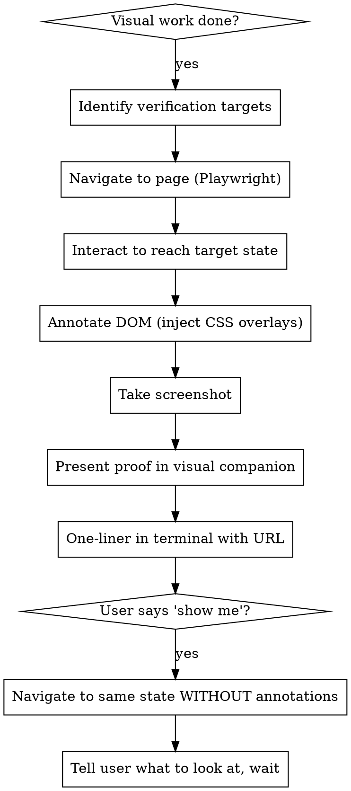

# Browser Verification

## Overview

**Core principle:** No visual completion claims without annotated screenshot proof.

If the work changed anything the user would see in a browser, you must prove it works with a screenshot — not words. This applies to ALL visual changes regardless of size.

**Violating the letter of this rule is violating the spirit of this rule.**

## The Proof Flow



### 1. Identify verification targets

List what changed visually and where. Use the code you just wrote to determine this.

### 2. Navigate and interact

Resize the browser to fullscreen first: `browser_resize` to 1920x1080. Then use `browser_navigate` to open the page. Log in if needed (check seeders or create an account). Interact to reach the state that exercises the change.

### 3. Annotate the DOM

Use `browser_evaluate` to inject overlays before screenshotting:

```javascript
// Example: annotate([{selector: '.status-badge', num: 1}, {selector: '.grid', num: 2}])
(annotations) => {
  annotations.forEach(({selector, num}) => {
    const el = document.querySelector(selector);
    if (!el) return;
    el.style.outline = '3px solid red';
    el.style.outlineOffset = '2px';
    el.style.position = el.style.position || 'relative';
    const badge = document.createElement('div');
    badge.textContent = num;
    badge.style.cssText = 'position:absolute;top:-12px;right:-12px;background:red;color:white;border-radius:50%;width:24px;height:24px;display:flex;align-items:center;justify-content:center;font-size:14px;font-weight:bold;z-index:99999;pointer-events:none;';
    el.appendChild(badge);
  });
}
```

Numbered badges (①②③) are injected on annotated elements. Keep them clean — no text labels on the screenshot.

In the visual companion, include a **hover legend** below the screenshot. Each numbered item shows a short title, and on hover expands to show what changed (before → after). Example HTML for the legend:

```html
<div style="cursor:pointer;padding:8px 12px;border-radius:8px;transition:all 0.2s"
     onmouseover="this.querySelector('.detail').style.display='block'"
     onmouseout="this.querySelector('.detail').style.display='none'">
  <strong style="color:red">①</strong> Product summary grid
  <div class="detail" style="display:none;margin-top:4px;color:#666;font-size:13px">
    Before: No product details shown in order rows<br>
    After: Grid showing Technology, Bandwidth, NRC, MRC per product
  </div>
</div>
```

Determine selectors from the code you wrote + `browser_snapshot` if needed.

### 4. Screenshot and present

Take screenshot with `browser_take_screenshot`. Present in the visual companion:

- Start the visual companion if not running: `scripts/start-server.sh --project-dir <project-path>`
- If already running (check for `.server-info` file in screen_dir), reuse it
- Write an HTML page with the annotated screenshot (base64 data URI) + legend + verdict. The legend describes what changed (before → after) for each labeled element.
- Terminal: one-liner with the URL. Nothing else.

### 5. Multiple states

Some work needs multiple screenshots (e.g., form → validation error → success). Each state gets its own annotated screenshot shown as a storyboard. Max ~5 per verification.

### 6. "Show me" hand-off

User says "show me" → navigate to the same state WITHOUT annotations → tell them what page is open, what credentials, what to look at → wait.

## Red Flags — STOP

- "It works in the browser" without a screenshot
- "I verified visually" without proof
- "The component renders correctly" without navigating to it
- Skipping because "the tests pass"
- Skipping because "it's just a small CSS change"
- Skipping because "it's just a class name swap"
- Claiming Playwright isn't available without trying
- "The user can check it if they want"
- Pasting screenshot in terminal instead of visual companion because "the companion isn't running"
- Treating the visual companion as optional "presentation infrastructure"

## Rationalization Prevention

| Excuse | Reality |
|--------|---------|
| "Tests cover this" | Tests verify logic, not visual rendering. Screenshot it. |
| "It's a small CSS change" | Small changes break layouts. Tailwind can purge classes. Screenshot it. |
| "It's just a class name swap" | Class names can be misspelled, purged, or overridden. Screenshot it. |
| "Browser verification is theater for styling" | Styling IS visual. Visual changes need visual proof. That's the whole point. |
| "No behavior to verify" | You're not verifying behavior — you're verifying appearance. Screenshot it. |
| "Playwright isn't available" | Try first. If genuinely broken, tell the user — don't skip. |
| "The page requires auth I can't get" | Check seeders, create an account, ask the user. Don't skip. |
| "Too many states to screenshot" | Pick the most critical, max 5. Don't skip entirely. |
| "All friction with zero signal" | The signal IS the screenshot. That's the proof the user needs. |
| "Visual companion isn't running, I'll paste inline" | Start it. The companion is NOT optional — it's how proof is presented. Terminal screenshots are not a substitute. |
| "The companion is just presentation, the real proof is the screenshot" | The companion IS the required delivery mechanism. Screenshot + companion = proof. Screenshot alone = incomplete. |
