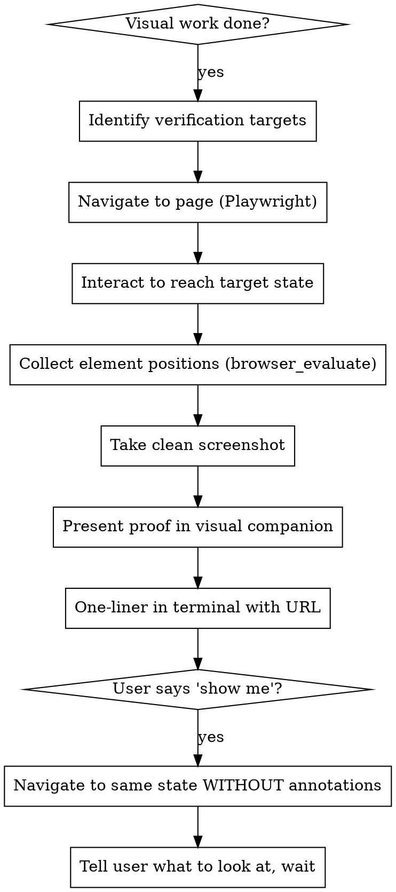

# Browser Verification

## Overview

**Core principle:** No visual completion claims without annotated screenshot proof.

If the work changed anything the user would see in a browser, you must prove it works with a screenshot — not words. This applies to ALL visual changes regardless of size.

**Violating the letter of this rule is violating the spirit of this rule.**

**REQUIRED: proof must be durable.** Write the proof page to the **proof store** by building a
payload and running:

```
php ~/.claude/skills/pipeline/checks/proof_cli.php write <payload.json>
```

It prints the page path; open that. Pasting screenshots inline in the terminal is NOT a
substitute, and neither is the brainstorming visual companion — that server is session-scoped,
serves only its newest file, and exits after 4 hours idle, so nothing written there survives to
review time.

The companion is still the right tool for the interactive **"show me" hand-off** (§6), where the
user is present and wants the live page rather than a record.

## The Proof Flow



### 1. Identify verification targets

List what changed visually and where. Use the code you just wrote to determine this.

### 2. Navigate and interact

Resize the browser to fullscreen first: `browser_resize` to 1920x1080. Then use `browser_navigate` to open the page. Log in if needed (check seeders or create an account). Interact to reach the state that exercises the change.

### 3. Collect element positions

Do NOT annotate the DOM. Instead, use `browser_evaluate` to collect bounding rects of target elements relative to the full page:

```javascript
// Returns positions for overlay badges in the visual companion
(selectors) => selectors.map(({selector, num}) => {
  const el = document.querySelector(selector);
  if (!el) return null;
  const rect = el.getBoundingClientRect();
  return {
    num,
    top: rect.top + window.scrollY,
    right: rect.right + window.scrollX,
    width: rect.width,
    height: rect.height,
  };
}).filter(Boolean)
```

### 4. Take a clean screenshot

Take a full-page screenshot with `browser_take_screenshot` — NO annotations on the page. The screenshot shows the real UI.

### 5. Present in visual companion with interactive overlays

Start the visual companion if not running. Build an HTML proof page that layers **hoverable badges** on top of the screenshot image using the collected positions.

**IMPORTANT: Images MUST be base64 data URIs.** The visual companion server only serves the HTML file — it does not serve sibling image files from the screen directory. Use ``, never relative paths like ``. Encode screenshots with Python (`base64.b64encode`) or shell (`base64 -i file.png`) and embed them inline in the HTML.

- The screenshot is the background (`` inside a `position:relative` container)
- Numbered red circle badges are `position:absolute` elements placed using the bounding rect data
- Each badge has a hover tooltip showing: title, before state, after state
- Below the screenshot, a full legend lists all items with before/after context (always visible)

Scale badge positions proportionally: `(position / pageWidth) * 100%` so they stay aligned when the image resizes.

Example badge overlay:

```html
<div style="position:relative;display:inline-block">
  
  <!-- Badge positioned from collected rects -->
  <div style="position:absolute;top:12%;right:42%;cursor:pointer"
       onmouseover="document.getElementById('tip-1').style.display='block'"
       onmouseout="document.getElementById('tip-1').style.display='none'">
    <div style="background:red;color:white;border-radius:50%;width:28px;height:28px;display:flex;align-items:center;justify-content:center;font-weight:bold;font-size:14px;box-shadow:0 2px 4px rgba(0,0,0,0.3)">1</div>
    <div id="tip-1" style="display:none;position:absolute;top:32px;left:0;background:white;border:1px solid #e5e7eb;border-radius:8px;padding:12px;min-width:280px;box-shadow:0 4px 12px rgba(0,0,0,0.15);z-index:10;font-size:13px">
      <strong>Product summary grid</strong><br>
      <span style="color:#999">Before:</span> No product details in order rows<br>
      <span style="color:#999">After:</span> Grid with Technology, Bandwidth, NRC, MRC
    </div>
  </div>
</div>
```

- Terminal: one-liner with the URL. Nothing else.

### 5. Multiple states

Some work needs multiple screenshots (e.g., form → validation error → success). Each state gets its own annotated screenshot shown as a storyboard. Max ~5 per verification.

### 6. "Show me" hand-off

User says "show me" → navigate to the same state WITHOUT annotations → tell them what page is open, what credentials, what to look at → wait.

## Red Flags — STOP

- "It works in the browser" without a screenshot
- "I verified visually" without proof
- "The component renders correctly" without navigating to it
- Skipping because "the tests pass"
- Skipping because "it's just a small CSS change"
- Skipping because "it's just a class name swap"
- Claiming Playwright isn't available without trying
- "The user can check it if they want"
- Pasting screenshot in terminal instead of visual companion because "the companion isn't running"
- Treating the visual companion as optional "presentation infrastructure"

## Rationalization Prevention

| Excuse | Reality |
|--------|---------|
| "Tests cover this" | Tests verify logic, not visual rendering. Screenshot it. |
| "It's a small CSS change" | Small changes break layouts. Tailwind can purge classes. Screenshot it. |
| "It's just a class name swap" | Class names can be misspelled, purged, or overridden. Screenshot it. |
| "Browser verification is theater for styling" | Styling IS visual. Visual changes need visual proof. That's the whole point. |
| "No behavior to verify" | You're not verifying behavior — you're verifying appearance. Screenshot it. |
| "Playwright isn't available" | Try first. If genuinely broken, tell the user — don't skip. |
| "The page requires auth I can't get" | Check seeders, create an account, ask the user. Don't skip. |
| "Too many states to screenshot" | Pick the most critical, max 5. Don't skip entirely. |
| "All friction with zero signal" | The signal IS the screenshot. That's the proof the user needs. |
| "I'll paste the screenshot inline instead" | Write the page to the proof store. Terminal screenshots are not a substitute — they scroll away and an `auto` run's subagent output is never read. |
| "The store is just filing, the real proof is the screenshot" | The store IS the required delivery mechanism. Screenshot + durable page = proof. A screenshot that outlives nothing is incomplete. |
