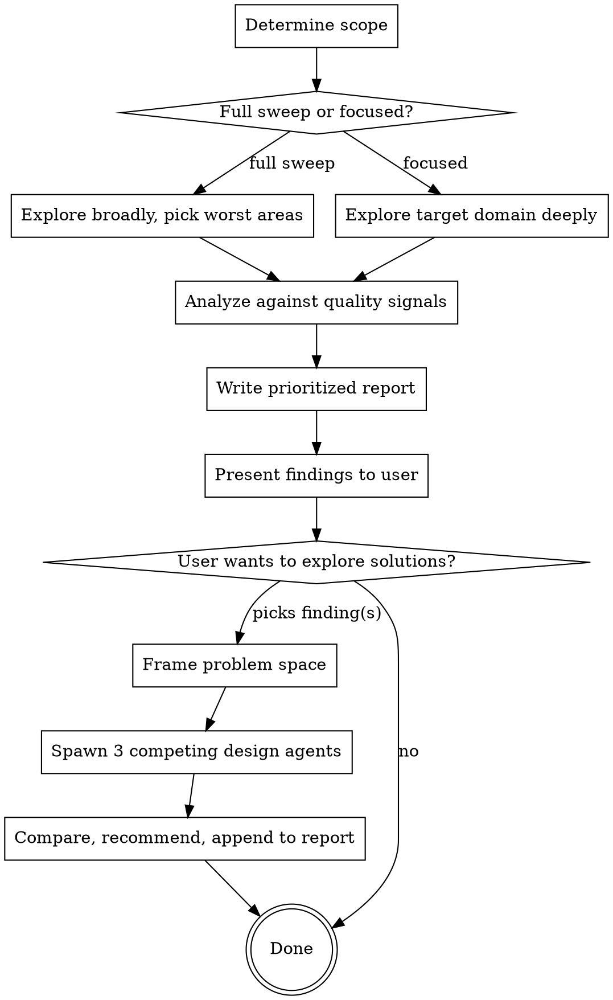

# Improve Codebase Architecture

A periodic architecture health check for Laravel projects. Explores a codebase organically, surfaces quality degradation, and produces a prioritized report. Optionally designs competing refactor approaches for specific findings.

## Process



## Step 1: Determine Scope

Ask the user or infer from their prompt:

- **Full sweep** — "review the architecture", "audit the project". Explore top-level structure first (app/ directories, services, models, Livewire components), then go deep on the 3-5 areas with the most friction.
- **Focused** — "review the order flow", "look at the availability checker". Read everything in the target domain thoroughly.

If ambiguous, ask.

## Step 2: Explore

Use Explore agents to navigate the codebase. No rigid file-by-file checklist — read code the way a senior developer would during a code review: follow call chains, notice patterns, feel where things are awkward. The friction you encounter IS the signal.

**Full sweep thoroughness:** In full sweep mode, dispatch multiple Explore agents in parallel to ensure broad coverage:
- Agent 1: Services, Actions, and business logic orchestration
- Agent 2: Livewire components and Blade templates (layer discipline)
- Agent 3: Models, Enums, ValueObjects, and data patterns (conventions, consistency, scattered logic)
- Agent 4: Routes, config, and cross-cutting concerns (routes pointing to wrong places, inconsistent conventions, debug code)

Do NOT stop at the first few issues you find. A health check must be comprehensive — finding 5 issues when there are 15 means the report can't be trusted for prioritization.

### Quality Signals

These are the things to look for. Every finding must reference specific code — no generic advice.

**Structural:**
- Classes or methods exceeding Sandi Metz guidelines (100 lines/class, 5 lines/method as soft targets)
- DRY violations — same logic in 3+ places without abstraction
- Dead code, unused abstractions, deprecated code still present
- Multiple unrelated classes in a single file

**Design:**
- Conditionals that should be polymorphism (if/else chains on type/status that belong in enum methods or strategy patterns)
- Scattered business logic — related rules spread across multiple classes instead of cohesive in one place
- Procedural code — sequential scripts that should be composed from objects/methods
- Null-safety band-aids (`?->`, `?:`, `if (!$x)` guards) masking root causes instead of fixing them
- Feature envy — methods that use another class's data more than their own (e.g. a Service reaching deep into a Model's relationships to compute something the Model should own)
- Long parameter lists / data clumps — methods with 5+ parameters, or the same group of fields traveling together across multiple methods, indicating a missing Value Object or Parameter Object

**Layer discipline (Laravel-specific):**
- **Livewire components** should be UI orchestration, not business logic. Check for query building, complex calculations, or domain rules inside components.
- **Models** should have relationships and casts, not computed business rules. Regular methods over `getXAttribute` accessors.
- **Services** handle orchestration and external integrations.
- **Enums** should carry behavior that varies by type/status (polymorphism over conditionals).
- **Blade** is presentation only — no `@php` blocks.
- **Facades** are the boundary for external APIs — business logic must not leak through.

**Consistency:**
- Data representation mismatches — e.g. cents in some tables, euros in others, leading to scattered `/ 100` and `* 100` conversions
- Convention violations — deviating from project-wide patterns (e.g. `$fillable` when project uses `$guarded = []`)
- Misplaced responsibilities — navigation built in models, routes pointing to wrong dashboards, logic in unexpected places

**Reliability:**
- Test gaps — areas with integration risk but no coverage
- Race conditions, unsafe patterns in production code
- Debug code (`ray()`, `dd()`, test routes) in production paths

### Dependency Categories

When assessing findings, classify the dependencies involved:

| Category | Laravel equivalent | Example |
|----------|-------------------|---------|
| In-process | Pure PHP | Enums, value objects, presenters, calculators |
| Local-substitutable | Test DB, fake disks | Test database, `Storage::fake()` |
| Facades as ports | Facade-wrapped clients | External API facades |
| True external | Third-party APIs | Services behind those facades |

## Step 3: Write Report

Save to `docs/superpowers/audits/YYYY-MM-DD-<topic>-audit.md`. Do NOT commit — leave it for the user to review.

### Report Format

```markdown
# Architecture Audit: <scope>
Date: YYYY-MM-DD

## Summary
2-3 sentences: overall health, main themes observed.

## What is Working Well
Acknowledge good patterns before listing problems. Be specific.

## Findings

### 1. [Descriptive title]
- **Severity**: High / Medium / Low
- **Migration risk**: High / Medium / Low
- **Category**: e.g. "God class", "Wrong layer", "DRY violation", "Scattered logic", "Procedural code"
- **Where**: File paths and line ranges
- **What's happening**: Concrete description referencing specific code
- **Why it matters**: What breaks, degrades, or becomes painful if left alone
- **Test coverage**: Sufficient / Insufficient — list existing tests that cover this area, and what's missing. If insufficient, tests must be written before refactoring.
- **Suggested direction**: One-liner on what a fix might look like (not a full design)

### 2. ...

## Health Summary
| Category | Count | Highest Severity |
|----------|-------|-----------------|

## Recommended Priority
Ordered list of which findings to address first and why.
Consider both severity and migration risk — a high-severity, low-migration-risk finding is a quick win.
```

**Report principles:**
- Findings sorted by severity, not discovery order
- Each finding is self-contained
- Every finding references specific files and lines
- "Suggested direction" is deliberately brief — detailed design is the refactor phase
- Include a "What is Working Well" section — this is a health check, not a roast

## Step 4: Present and Offer Refactor Phase

After presenting the report, ask:

> "Would you like to explore solutions for any of these findings?"

If the user declines, you're done. If they pick one or more findings, proceed to Step 5.

## Step 5: Refactor Phase (optional)

### Frame the Problem

Before spawning agents, write a user-facing explanation:
- The constraints any solution must satisfy
- What the code currently depends on and who calls it
- A rough code sketch to make the constraints concrete (not a proposal)

Show this to the user, then immediately proceed to the competing designs.

### Competing Designs

Spawn 3 agents in parallel, each with a different design constraint:

| Agent | Constraint | Tends to score well on |
|-------|-----------|----------------------|
| **Simplest change** | Minimum refactor, stay close to current patterns | Migration risk, speed |
| **Clean slate** | How you'd design it fresh, following project conventions | Code quality, long-term health |
| **Extract & generalize** | Could this be reusable? Belong in a shared package? | Cross-project value |

Each agent produces:
1. **What changes and where** — files affected, new files created
2. **Code sketch** — key parts, not a full implementation
3. **What it improves** — testability, readability, maintainability
4. **Backwards compatibility** — Does it change routes/APIs? Require migrations? Break existing callers? If it touches a shared package, does it break other projects?
5. **Trade-offs and migration effort**

### Compare and Recommend

Present all three designs, then give an opinionated recommendation — including hybrids if elements from different designs combine well. Explain why.

### Output

Append the chosen design to the audit report as a **Refactor Plan** section for that finding. From there the user can feed it into a planning skill for execution.

## Test Strategy Alignment

When recommending test improvements:
- Recommend Feature tests, not Unit tests (unless isolation is genuinely needed)
- `Livewire::test()` is the primary assertion surface
- Facades for mocking external services
- Don't suggest unit tests for code already covered by feature tests
- Boundary tests replace shallow-module tests — replace, don't layer
