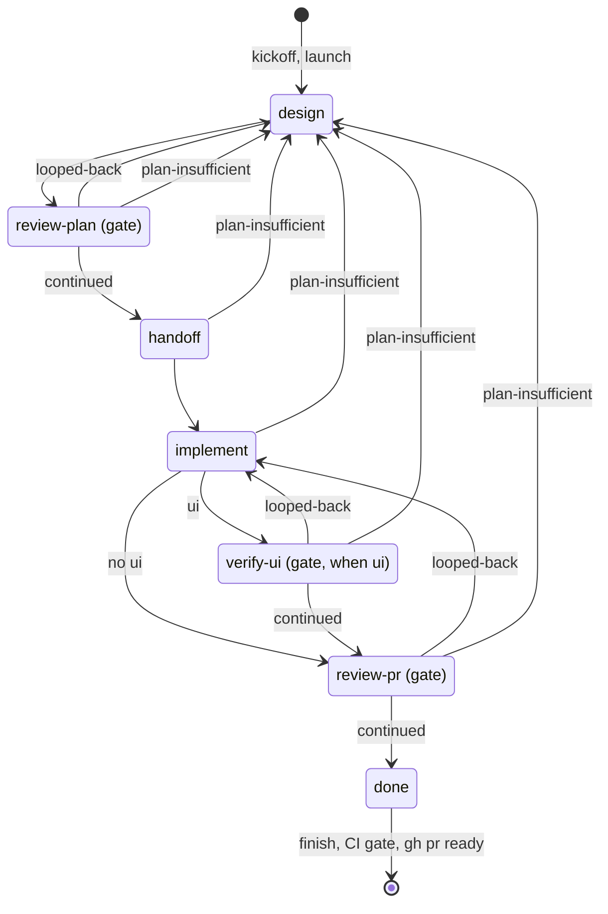

# pipeline

## What the pipeline is

A **trampoline** that walks a feature through its chain of station skills, carrying state from one to the next so
the review gates become un-skippable **by construction** rather than by memory. It is the *spine*, not better
station logic: each station owns its own quality (`brainstorming`, `writing-plans`, `/critique`,
`browser-verification`), and the pipeline invokes them without reimplementing their judgment. Two legs are no skill:
`handoff` is a command and `implement` a procedure the pipeline owns. The legs are `pipeline_legs()`: `design`,
`review-plan`, `handoff`, `implement`, `verify-ui`, `review-pr`. **A loop that only loops; every step is a fresh
agent**: in `autoflow` the loop is a program, the saved workflow `pipeline-autoflow`; `interactive` walks the same
legs with the human resolving each review. No long-lived brain; a lost run reconstructs from git + gh.

## Invocation

```
/pipeline [interactive|autoflow] [medium|light] [base <branch>] <idea | number | spec-path>   # start a run
/pipeline                                                                                     # resume the current branch's run
```

The invoking session reads `references/session.md` before it drives a run.

## The state machine



The gates are `review-plan`, `verify-ui` when the `ui` trigger fires, and `review-pr`; each loop-back is bounded
(`references/gates.md` §Loop-backs). `plan-insufficient` is a Bounded design's escalation or an Architectural
plan's gap (`references/shared/plan-falls-short.md`).

## Per step

| Step | Who runs it | What it writes | Through | Reference |
|---|---|---|---|---|
| `kickoff, launch` | the invoking session | the worktree, the branch, the first manifest, the board claim | `kickoff`, `launch` | `references/session.md` |
| `design:run` | the session inline (`interactive`) | the spec and the plan, committed; `artifacts.spec`, `artifacts.plan` | `record` | `references/steps/design.md` |
| `design:spec` | a workflow step agent | the spec (and a Bounded plan), committed; `artifacts.spec` | `brief`, `record`, `size` | `references/steps/design.md` |
| `design:plan` | a workflow step agent | the plan, committed; `artifacts.plan` | `brief`, `record`, `size` | `references/steps/design.md` |
| `review-plan:review` | a step agent | the open `plan-approval` ledger entry | `brief`, `record` | `references/steps/review-plan-review.md` |
| `review-plan:resolve` | a step agent; the session inline in `interactive` | spec and plan commits; the entry's actions and outcome | `brief`, `record` | `references/steps/review-plan-resolve.md` |
| `handoff:run` | a step agent | the push, the draft PR, the Component, the proof page; `artifacts.pr`, `artifacts.proof` | `brief`, `handoff` | `references/steps/handoff.md` |
| `implement:run` | a step agent | code commits, the push; `suite`, `last_sha` | `brief`, `suite`, `record`, `ui` | `references/steps/implement.md` |
| `verify-ui:run` | a step agent | shots on the proof page, a text-only PR comment; the `verify-ui` entry | `brief`, `proof_cli.php write`, `record` | `references/steps/verify-ui.md` |
| `review-pr:review` | a step agent | the open `pr-review` entry with `reviewed_sha` | `brief`, `record` | `references/steps/review-pr-review.md` |
| `review-pr:resolve` | a step agent; the session inline in `interactive` | fix commits, the PR body, the final proof page; the entry's actions and `issue_links` | `brief`, `suite`, `proof_cli.php write`, `record` | `references/steps/finish.md` |
| `finish, CI gate, ready` | the invoking session | the cursor's `done` or halt, the PR out of draft, the page Ready | `finish`, `ci`, `gh pr ready` | `references/session.md` |

## Where a run stops

| Stop | What exists | Governed by |
|---|---|---|
| a kickoff halt | nothing: no worktree, branch or manifest | `references/session.md` §Failure policy |
| a halt before `handoff` | commits on the branch; no push, no PR | `references/session.md` §Failure policy |
| a halt after `handoff` | the draft PR with the reason in its body; the proof page Halted | `references/session.md` §Failure policy, `references/proof-store.md` §Statuses |
| `done` | the PR ready after the CI gate | `references/session.md` §The CI gate |
| `ask` | the PR draft until every `blocking` question is answered | `references/session.md` §Open questions |

## The references

- The invoking session → `references/session.md`.
- A step agent → its file under `references/steps/`, which names the `references/shared/` files it reads.
- Gates, content triggers and the navigation guardrail → `references/gates.md`.
- The manifest → `references/manifest.md`.
- The proof store → `references/proof-store.md`.
- How the code enforces a run → `references/machinery.md`.
- Why it is as it is → `DECISIONS.md`.

## Non-goals

- **Replacing any station's judgment.** The pipeline sequences skills; it does not out-think them.
- **New review logic** (that is `/critique`) or **new bug-hunting** (that is `/code-review`).
- **Tearing down a worktree before its PR is merged,** or one the run did not create. After the
  merge the run removes its own slot without asking (`references/session.md` §After the merge).
- **Posting to GitHub beyond what the steps do** (§Per step), and nothing it writes ever addresses a person.
- **A findings store, or any persistent state not reconstructable** from git + gh.
