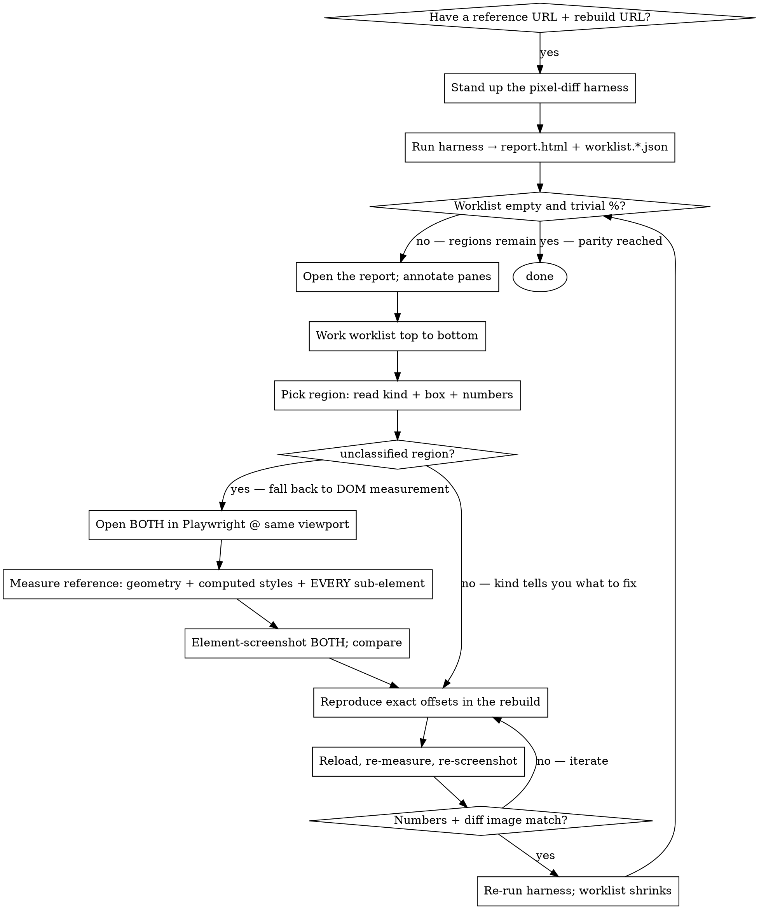

# Visual Parity (reference-matched rework)

## Overview

**Core principle: parity is proven by MEASUREMENT and side-by-side pixel diffs — never by eyeballing.**

When there is a reference to match (a legacy app, an old design, a page being ported to a new stack), you **cannot trust your own glance** — not even at a screenshot. You will repeatedly miss real differences the user sees instantly: a bubble overlapping an avatar, wrong z-order, missing connector dots, a peach dome that's 200px too short, spacing that's 76px off, the wrong shade of orange. "It looks the same to me" is not evidence.

Replace looking with two instruments:

1. A **pixel-diff harness** that loads both sides, crops them into content-aligned bands, and renders a `legacy │ rebuild │ diff` report (red = differs).
2. **DOM measurement** of *both* sides (`getBoundingClientRect` + `getComputedStyle` + element screenshots) before and after every change — reproduce the reference's exact numbers.

This is the complement to **browser-verification**: that skill proves *your* work renders; this one proves it **matches a reference**. Use both — measure parity here, then present the proof with browser-verification.

## When to use

- Rewriting a page onto a new stack (Vue→Livewire, AngularJS→React, Blade→Inertia…) where it must look the same.
- Porting across framework/CSS versions (Tailwind 3→4, Bootstrap→Tailwind).
- Implementing a design that already exists somewhere (a staging URL, a Figma export rendered in a browser, the old production site).

If there is **no** reference to match, you don't need this — use browser-verification alone.

## The loop



**The worklist — not the % — is the gate.** The harness writes `out/worklist.<surface>.<viewport>.json` alongside `report.html`. Each region in the worklist has a bounding box, a kind, pixel count, and status (`open` / `wontfix` / `fixed`). Work the open regions top to bottom; when the worklist is empty, the surface is done.

**Kind vocabulary (machine-assigned — you never pick one).** The classifier labels each difference `recolor`, `shift`, `resize`, `missing`, `extra`, `typography`, `overlap`, or `unclassified`; a box *you* draw shows as `you` until the next run classifies it. Your only inputs are a free-text **note** and an **ignore** toggle. Marking a region `ignore` (status `wontfix`) — not its kind — is the mechanism for intentional diffs; they are excluded from the adjusted %.

- **`unclassified` regions** are where the harness couldn't match a DOM element — fall back to manual measurement with `getBoundingClientRect`.
- **`wontfix` regions** are intentional differences (a removed feature, a known divergence). Mark them via `--serve`; they are excluded from the **adjusted %** on re-run.
- **Fixed regions** drop out automatically on the next harness run once the diff pixels disappear.

## 1. Stand up the harness

The engine lives in **the skill** — don't copy it into the project. Run it from here against a small project config that **Claude** owns:

```bash
# one-time deps (installed once in the skill dir; chromium is cached globally)
cd ~/.claude/skills/visual-parity && npm init -y && npm i -D playwright pixelmatch pngjs && npx playwright install chromium

# then, from the project (after authoring visual-parity.config.mjs — see below):
node ~/.claude/skills/visual-parity/parity-harness.mjs --config ./visual-parity.config.mjs        # all surfaces
node ~/.claude/skills/visual-parity/parity-harness.mjs --config ./visual-parity.config.mjs home    # one surface, BOTH viewports
```

Reports + worklists land in `./out/` next to the config. With **no** `--config` the harness falls back to an in-file CONFIG block (legacy single-file mode), so older copied setups keep working. Run **without a viewport arg** to keep desktop + mobile together.

**The config is Claude's artifact** — you generate and maintain it; the user only ever touches the report. Commit it in the project for reproducibility:

```js
// visual-parity.config.mjs
export default {
  legacy:  'https://reference.example.com',
  rebuild: 'https://rebuild.example.test',
  viewports: [ { name:'desktop', width:1920, height:1080 }, { name:'mobile', width:390, height:844 } ],
  noiseMinPixels: 12,
  threshold: 0.1,
  authProfiles: { member: 'auth.member.json' },          // profile -> storageState file (relative to config)
  surfaces: [
    { name:'home', path:'/', waitText:'…', report:'public', sections:[
        { name:'nav', fixedTop:0 }, { name:'hero', anchor:'Hero heading' }, { name:'footer', selector:'footer' } ] },
    { name:'dashboard', path:'/dashboard', waitText:'…', auth:'member', report:'members', sections:[
        { name:'content', anchor:'Welcome' } ] },
  ],
};
```

**Anchoring a section — `anchor:` is only one of three modes.** Each section is cut at its top by exactly one of these (see `parity-harness.mjs` `anchorTops`):

| Mode | Use when | Example |
|------|----------|---------|
| `fixedTop: <y>` | A known/sticky band (nav at `0`), or a page that opens straight into content with no heading (`fixedTop:0` = whole page as one band) | `{ name:'nav', fixedTop:0 }` |
| `anchor: 'text'` | The band starts at an `<h1/h2/h3>` whose text contains this string | `{ name:'hero', anchor:'Hero heading' }` |
| `selector: 'css'` | **No heading to anchor on** — cut at any element instead (the one selector is matched independently on each side, so they self-align even across different markup) | `{ name:'grid', selector:'.video-grid' }` |

**"This page has no heading" is a one-line config fix — never a reason to abandon the harness.** A page that opens on a grid / gallery / table with no heading uses `selector:` (a stable wrapper present on both sides) or `fixedTop:0`. That's exactly what those modes are for; reaching for one is a 30-second edit, not a workaround.

**The report IS the harness output.** The deliverable for a phase is whatever `parity-harness.mjs` writes to `out/report.*.html` — that file, with its content-aligned bands, pixel diff, band heights, and worklist. Never capture screenshots by hand and assemble your own side-by-side HTML to stand in for it: a collage has no diff, no heights, no worklist, so it answers "do these look similar?" (the eyeballing this skill exists to forbid) instead of "does the rebuild match?".

**Read the report — don't eyeball the diff.** Open `out/report.<name>.html`. Each section is **legacy │ rebuild │ fix-list**: the two readable panes are the annotation surface (drag a box on either), and the **fix-list** is the punch-list of differences — machine-found *and* the boxes you draw. The raw red diff sits behind a `show raw diff ▸` toggle. **You never pick a category** — the machine labels each difference and a box you draw comes back labelled on the next run (`you` until then). Your only inputs are a **note** and an **ignore** toggle.

**Hand feedback back with "Copy feedback"** — it serializes the fix-list to Markdown onto your clipboard and works whether the report is opened as a `file://` page *or* served (no server, no CORS, never hangs). Paste it back, or screenshot a section (the panes are fully labelled). Optionally run `--serve` (default :8088) to additionally persist annotations to `out/worklist.*.json` on disk — a **Save to disk** button appears only when served.

**Named reports + per-surface auth.** Tag a surface `report:'X'` and it lands in `report.X.html`; one run emits one file per tag (untagged → `report.html`), so a single sweep covers public + member states without clobbering. Tag a surface `auth:'profile'` to capture it logged in. Mint a profile's combined (both-sides) storageState with the `login-state.mjs` template: `node login-state.mjs <email> <password> auth.member.json`.

**CONFIG knobs** (in `visual-parity.config.mjs`):

| Knob | Default | Effect |
|------|---------|--------|
| `NOISE_MIN_PIXELS` | `12` | Diff blobs smaller than this changed-pixel count are silently dropped. Raise to suppress anti-aliasing noise; lower to surface tiny regressions. |
| `SERVE_PORT` | `8088` | HTTP port for `--serve` annotation mode. Override on the CLI by passing a bare number: `node parity-harness.mjs --serve 9000`. |
| `threshold` (in `PIXELMATCH_OPTS`) | `0.1` | Per-pixel colour-delta cutoff. A **subtle recolor can fall *under* it** and never register as a changed pixel — so it won't reach the worklist. Lower toward `0.05` when near-pixel *colour* parity matters, at the cost of more anti-alias noise. |

How it works (and why): the two sides are different DOM (a rewrite), so it diffs **pixels**, not elements — aligned by **content anchors** (heading text), section by section. It dismisses cookie banners, scrolls to trigger lazy images, masks dynamic regions (iframes/video), and ignores anti-aliasing (`includeAA:false`) so font-hinting differences across stacks don't show as diffs. Each band reports `%diff`, `adj %` (wontfix excluded), open-region count, **and** `legacy Xpx / rebuild Ypx` heights. The worklist JSON captures every located region with kind, box, and status so you work it top to bottom rather than chasing the `%` number.

## 2. Measure — don't eyeball

For the diverging band, open the reference and the rebuild in Playwright at the **same** viewport and read real numbers. Glancing at the report tells you *that* something differs; measuring tells you *what*.

```javascript
// Element geometry relative to a section's top — run on BOTH sides, compare.
() => {
  const r = el => { const b = el.getBoundingClientRect();
    return { top: Math.round(b.top + scrollY), left: Math.round(b.left),
             w: Math.round(b.width), h: Math.round(b.height) }; };
  const find = re => [...document.querySelectorAll('*')]
    .find(e => re.test(e.textContent) && e.children.length === 0);
  // measure the box, the target element, AND every sub-element:
  // wrappers, badges, dots, ::before/::after, z-order, and getComputedStyle
  // (color, font, padding, border-radius, background-size/position).
  return { /* … */ };
}
```

Rules that catch what eyeballing misses:

- **Account for EVERY sub-element.** The thing you're missing is usually a small one — a connector dot, a badge, a tail, a pseudo-element, a shadow, a z-index. Enumerate the reference's children; don't approximate the shape.
- **Reproduce exact offsets**, then re-measure to confirm (legacy top 156 → rebuild top 156, not "looks about right").
- **Element-screenshot both** (`browser_take_screenshot` with `target`) and look at them next to each other — but only as a check on the numbers, not a substitute.
- **Iterate in place**: edit → reload → re-measure → re-screenshot. Don't batch changes blindly.

## Caveats that bite

- **A dead page scores.** Two identical error pages diff to a flawless **0.00%** — a down stack reads as perfect parity, which is why the harness refuses to score a page it cannot trust: a 4xx/5xx status, a known fatal-error marker in the rendered text, or a blank document aborts the whole run, naming the side, the status and the URL. If a run aborts, fix the page and re-run; never route around the gate to get a number out of it.
- **The % undercounts on background-dominated bands.** A section that's mostly white/peach with small content can read **4%** while looking completely wrong — the changed pixels are a tiny fraction. **Trust the diff IMAGE and the band-height convergence, not the % alone.** A low % is necessary, not sufficient.
- **Anti-aliasing / font hinting** differs across stacks → keep `includeAA:false`, or text edges flood the diff.
- **Subtle recolors can slip *under* `threshold`.** `PIXELMATCH_OPTS.threshold: 0.1` is lenient (it keeps AA noise down), so a small colour shift — a few levels per channel — may never register as a changed pixel and so never reaches the worklist at all (the `%` and the worklist both read clean). When *colour* parity matters, lower `threshold` (try `0.05`) and re-run; expect more AA noise in return. A near-zero `%` with an empty worklist is necessary, not sufficient — confirm against the diff image.
- **Dynamic regions** (video thumbnails, carousels, ad slots, randomized content) must be masked/hidden or they diff run-to-run.
- **Dismiss consent/cookie overlays** on both sides, and **scroll to trigger lazy images** before screenshotting.
- A reference's **production overlays** (surveys, chat widgets) may appear — hide them in the page before measuring.

## Red Flags — STOP

- "It looks the same to me" / "looks close enough" — you can't tell by looking; measure.
- "The diff is only 4%, ship it" — open the diff image; the % undercounts background-heavy bands.
- "I'll eyeball the spacing/position" — read the reference's `getBoundingClientRect`.
- Claiming parity without ever measuring the reference's element geometry.
- Reproducing the shape but skipping its sub-elements (dots, badges, pseudo, shadows).
- Running one viewport and calling the report complete.
- Batching many CSS guesses, then looking once at the end.
- "This page has no heading, so the harness can't do this surface" — `anchor:` is one of three cut modes; use `selector:`/`fixedTop:`. Never hand-build a stand-in report.

## Rationalization table

| Excuse | Reality |
|--------|---------|
| "I can see it matches" | You repeatedly can't — that's why this skill exists. Measure both sides. |
| "4% diff is basically identical" | On a white/peach band, 4% can be a totally wrong layout. Check the diff image + heights. |
| "Pixel-perfect is overkill" | The bar is whatever the user set. If they said pixel/near parity, measure to it. |
| "The screenshot looks right" | Screenshots fool you too. The numbers don't. Use the screenshot to confirm the numbers. |
| "Close enough, the dome shape is the same" | If a value is 76px off, it's not close — find the px and fix it. |
| "It's just a decorative dot" | The user will notice the missing dot. Enumerate every sub-element of the reference. |
| "I'll check all viewports at the end" | Run them together now; mobile usually diverges most and silently. |
| "The worklist is empty so it's done" | Empty worklist with a non-trivial pixel% means the noise floor hid regions or the diff is background-only — open the diff image and lower `NOISE_MIN_PIXELS`. |
| "No heading here, so I'll just capture + hand-build the report" | `anchor:` is one of three section-cut modes — no heading → `selector:`/`fixedTop:`. The harness's `out/report.*.html` is the only report; a hand-built collage hides every real diff. |
