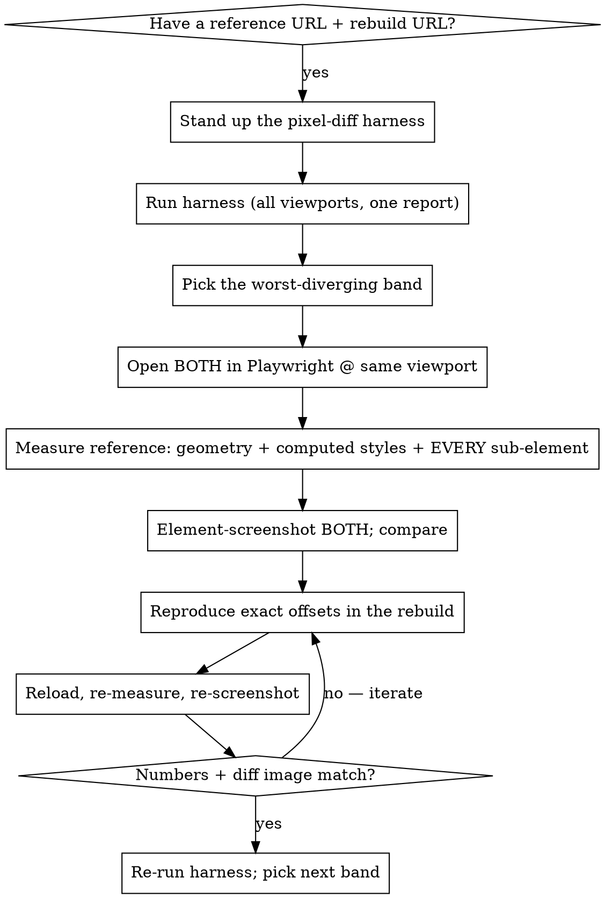

# Visual Parity (reference-matched rework)

## Overview

**Core principle: parity is proven by MEASUREMENT and side-by-side pixel diffs — never by eyeballing.**

When there is a reference to match (a legacy app, an old design, a page being ported to a new stack), you **cannot trust your own glance** — not even at a screenshot. You will repeatedly miss real differences the user sees instantly: a bubble overlapping an avatar, wrong z-order, missing connector dots, a peach dome that's 200px too short, spacing that's 76px off, the wrong shade of orange. "It looks the same to me" is not evidence.

Replace looking with two instruments:

1. A **pixel-diff harness** that loads both sides, crops them into content-aligned bands, and renders a `legacy │ rebuild │ diff` report (red = differs).
2. **DOM measurement** of *both* sides (`getBoundingClientRect` + `getComputedStyle` + element screenshots) before and after every change — reproduce the reference's exact numbers.

This is the complement to **browser-verification**: that skill proves *your* work renders; this one proves it **matches a reference**. Use both — measure parity here, then present the proof with browser-verification.

## When to use

- Rewriting a page onto a new stack (Vue→Livewire, AngularJS→React, Blade→Inertia…) where it must look the same.
- Porting across framework/CSS versions (Tailwind 3→4, Bootstrap→Tailwind).
- Implementing a design that already exists somewhere (a staging URL, a Figma export rendered in a browser, the old production site).

If there is **no** reference to match, you don't need this — use browser-verification alone.

## The loop



## 1. Stand up the harness

Copy `parity-harness.mjs` (next to this skill) into the project (e.g. `tools/visual-parity/`) and edit the **CONFIG block** at the top: `LEGACY` / `REBUILD` URLs, the `VIEWPORTS`, and `SURFACES` (each page + its sections, cut by heading-text anchors top→bottom). Then:

```bash
cd tools/visual-parity
npm init -y && npm i -D playwright pixelmatch pngjs && npx playwright install chromium
node parity.mjs                 # ALL surfaces, ALL viewports → out/report.html
node parity.mjs home            # one surface, BOTH viewports (no viewport arg!)
open out/report.html
```

**Run without a viewport arg to keep desktop + mobile in one report.** Passing a single viewport (`node parity.mjs home desktop`) overwrites `report.html` with just that viewport — a common footgun. The report is regenerated each run.

How it works (and why): the two sides are different DOM (a rewrite), so it diffs **pixels**, not elements — aligned by **content anchors** (heading text), section by section. It dismisses cookie banners, scrolls to trigger lazy images, masks dynamic regions (iframes/video), and ignores anti-aliasing (`includeAA:false`) so font-hinting differences across stacks don't show as diffs. Each band reports `%diff` **and** `legacy Xpx / rebuild Ypx` heights.

## 2. Measure — don't eyeball

For the diverging band, open the reference and the rebuild in Playwright at the **same** viewport and read real numbers. Glancing at the report tells you *that* something differs; measuring tells you *what*.

```javascript
// Element geometry relative to a section's top — run on BOTH sides, compare.
() => {
  const r = el => { const b = el.getBoundingClientRect();
    return { top: Math.round(b.top + scrollY), left: Math.round(b.left),
             w: Math.round(b.width), h: Math.round(b.height) }; };
  const find = re => [...document.querySelectorAll('*')]
    .find(e => re.test(e.textContent) && e.children.length === 0);
  // measure the box, the target element, AND every sub-element:
  // wrappers, badges, dots, ::before/::after, z-order, and getComputedStyle
  // (color, font, padding, border-radius, background-size/position).
  return { /* … */ };
}
```

Rules that catch what eyeballing misses:

- **Account for EVERY sub-element.** The thing you're missing is usually a small one — a connector dot, a badge, a tail, a pseudo-element, a shadow, a z-index. Enumerate the reference's children; don't approximate the shape.
- **Reproduce exact offsets**, then re-measure to confirm (legacy top 156 → rebuild top 156, not "looks about right").
- **Element-screenshot both** (`browser_take_screenshot` with `target`) and look at them next to each other — but only as a check on the numbers, not a substitute.
- **Iterate in place**: edit → reload → re-measure → re-screenshot. Don't batch changes blindly.

## Caveats that bite

- **The % undercounts on background-dominated bands.** A section that's mostly white/peach with small content can read **4%** while looking completely wrong — the changed pixels are a tiny fraction. **Trust the diff IMAGE and the band-height convergence, not the % alone.** A low % is necessary, not sufficient.
- **Anti-aliasing / font hinting** differs across stacks → keep `includeAA:false`, or text edges flood the diff.
- **Dynamic regions** (video thumbnails, carousels, ad slots, randomized content) must be masked/hidden or they diff run-to-run.
- **Dismiss consent/cookie overlays** on both sides, and **scroll to trigger lazy images** before screenshotting.
- A reference's **production overlays** (surveys, chat widgets) may appear — hide them in the page before measuring.

## Red Flags — STOP

- "It looks the same to me" / "looks close enough" — you can't tell by looking; measure.
- "The diff is only 4%, ship it" — open the diff image; the % undercounts background-heavy bands.
- "I'll eyeball the spacing/position" — read the reference's `getBoundingClientRect`.
- Claiming parity without ever measuring the reference's element geometry.
- Reproducing the shape but skipping its sub-elements (dots, badges, pseudo, shadows).
- Running one viewport and calling the report complete.
- Batching many CSS guesses, then looking once at the end.

## Rationalization table

| Excuse | Reality |
|--------|---------|
| "I can see it matches" | You repeatedly can't — that's why this skill exists. Measure both sides. |
| "4% diff is basically identical" | On a white/peach band, 4% can be a totally wrong layout. Check the diff image + heights. |
| "Pixel-perfect is overkill" | The bar is whatever the user set. If they said pixel/near parity, measure to it. |
| "The screenshot looks right" | Screenshots fool you too. The numbers don't. Use the screenshot to confirm the numbers. |
| "Close enough, the dome shape is the same" | If a value is 76px off, it's not close — find the px and fix it. |
| "It's just a decorative dot" | The user will notice the missing dot. Enumerate every sub-element of the reference. |
| "I'll check all viewports at the end" | Run them together now; mobile usually diverges most and silently. |
